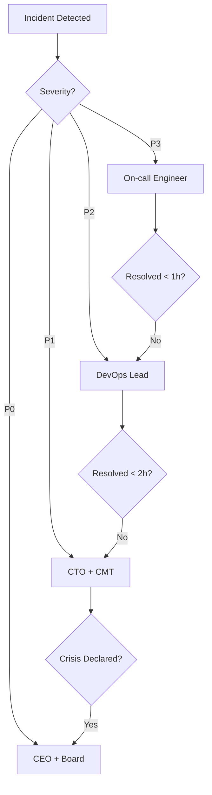

# Template ISO 22301:2019 - Business Continuity Management System (BCMS)

*Template especializado para geração de documentação ISO 22301:2019 (Business Continuity Management System) com foco em BC/DR e Crisis Management*

---

## Introdução ao ISO 22301:2019

**ISO 22301:2019** é o padrão internacional para Business Continuity Management System (BCMS). Define requisitos para planejar, estabelecer, implementar, operar, monitorar, revisar, manter e melhorar continuamente um sistema documentado de gestão para preparar, responder e recuperar de eventos disruptivos.

**Objetivo deste Template:**
Guiar a geração de documentação completa de BCMS que atenda aos requisitos da norma ISO 22301:2019 e prepare a organização para responder a desastres e manter continuidade operacional.

**Aplicável para:**
- Organizações com processos críticos de negócio
- Fintechs, SaaS, Healthcare, infraestrutura crítica
- Empresas que precisam demonstrar resiliência para clientes/parceiros
- Resposta a requisitos de Due Diligence (ex: Serasa Experian)
- Preparação para certificação ISO 22301

---

## 🎯 **Mapeamento Due Diligence Serasa Experian**

**CRÍTICO:** Este template mapeia **5 de 8 requisitos** da solicitação Serasa Experian:

| # | Requisito Serasa | Documento ISO 22301 | Status |
|---|------------------|---------------------|--------|
| 1 | Plano de Continuidade de Negócios | `business-continuity-plan.md` | ✅ |
| 2 | Plano de Recuperação de Desastres | `disaster-recovery-plan.md` | ✅ |
| 3 | Plano de Gerenciamento de Crise | `crisis-management.md` | ✅ |
| 4 | Evidências de testes anuais BC/DR | `resilience-testing.md` | ✅ |
| 5 | Política backup/restauração RTOs/RPOs | `recovery-objectives.md` | ✅ |
| 6 | Certificado ISO 22301 ou SOC2 | (Certificação opcional) | 🔄 |
| 7 | Confirmação SLAs | → SOC2 Template | - |
| 8 | Documentação Contratual SLAs | → SOC2 Template | - |

**Cobertura Serasa:** 5/5 requisitos de BC/DR ✅

---

## Documentos Obrigatórios do BCMS

O specialist agent `@iso-22301-specialist` deve gerar **5 documentos principais**:

| # | Documento | Arquivo | Seção ISO 22301 | Requisito Serasa |
|---|-----------|---------|-----------------|------------------|
| 1 | Business Continuity Plan (BCP) | `business-continuity-plan.md` | Cláusula 8.4 | ✅ Req #1 |
| 2 | Disaster Recovery Plan (DRP) | `disaster-recovery-plan.md` | Cláusula 8.4.3 | ✅ Req #2 |
| 3 | Plano de Gerenciamento de Crise | `crisis-management.md` | Cláusula 8.4.4 | ✅ Req #3 |
| 4 | Testes de Resiliência | `resilience-testing.md` | Cláusula 8.5 | ✅ Req #4 |
| 5 | Recovery Objectives (RTOs/RPOs) | `recovery-objectives.md` | Cláusula 8.2.3 | ✅ Req #5 |

**Output Directory:** `docs/compliance/business-continuity/`

---

## 1. business-continuity-plan.md

### Objetivo
Documentar o Business Continuity Plan (BCP) da organização conforme ISO 22301:2019 Cláusula 8.4, estabelecendo estratégias e procedimentos para manter operações críticas durante e após eventos disruptivos.

**Responde:** ✅ **Serasa Req #1** - "Plano de Continuidade de Negócios: ênfase nos processos que sustentam nosso contrato"

### Seções Obrigatórias

#### 1.1 Escopo do BCP (PT-BR)
```markdown
# Business Continuity Plan (BCP) - [Nome da Empresa]

## Escopo

### Processos Críticos Cobertos
Este BCP cobre os seguintes processos críticos que sustentam operações com clientes enterprise (incluindo Serasa Experian):

1. **Processamento de Transações Financeiras**
   - Escopo: APIs de pagamento, autorização, liquidação
   - Criticidade: Crítica
   - Sistemas: Payment Gateway, Risk Engine, Core Banking APIs

2. **Autenticação e Autorização de Usuários**
   - Escopo: Login, SSO, MFA, gestão de sessões
   - Criticidade: Crítica
   - Sistemas: Auth Service (Auth0), User Database, Session Store

3. **APIs Core de Integração**
   - Escopo: APIs RESTful que clientes dependem
   - Criticidade: Crítica
   - Sistemas: API Gateway, Backend Services, Cache Layer

4. **Processamento de Dados e Analytics**
   - Escopo: ETL, dashboards, relatórios para clientes
   - Criticidade: Alta
   - Sistemas: Data Pipeline, Analytics DB, BI Tools

### Áreas Organizacionais Incluídas
- Engineering (Backend, DevOps, SRE)
- Product (decisões de priorização em crises)
- Customer Success (comunicação com clientes)
- Security (validação de segurança pós-recuperação)

### Exclusões
- Processos administrativos não-críticos (RH, financeiro interno)
- Sistemas de desenvolvimento/staging (apenas produção é coberto)
```

#### 1.2 Business Impact Analysis (BIA)
```markdown
## Business Impact Analysis (BIA)

### Metodologia
Análise conduzida em [Data] com stakeholders de Engineering, Product e Customer Success.

### Processos Críticos Identificados

#### Processo 1: Processamento de Transações Financeiras

**Maximum Tolerable Period of Disruption (MTPD):** 4 horas  
**Recovery Time Objective (RTO):** 1 hora  
**Recovery Point Objective (RPO):** 15 minutos

**Impactos se Indisponível:**
- **Financeiro:** R$ 500K/hora em transações não processadas
- **Reputacional:** Perda de confiança de clientes enterprise
- **Legal:** Violação de SLAs contratuais (multas ~R$ 100K/dia)
- **Operacional:** Backlog de transações, necessidade de reconciliação manual

**Dependências Críticas:**
- AWS RDS (PostgreSQL Multi-AZ)
- AWS ElastiCache (Redis)
- Payment Provider APIs (Stripe, PagSeguro)
- Risk Engine (interno)

---

#### Processo 2: Autenticação de Usuários

**MTPD:** 2 horas  
**RTO:** 30 minutos  
**RPO:** 0 (sem perda de dados aceitável)

**Impactos se Indisponível:**
- **Financeiro:** Usuários não conseguem fazer login = zero transações
- **Reputacional:** Percepção de instabilidade da plataforma
- **Legal:** Violação de SLAs (disponibilidade 99.9%)
- **Operacional:** Suporte sobrecarregado com tickets

**Dependências Críticas:**
- Auth0 (SaaS, SLA 99.99%)
- AWS RDS (user database)
- Redis (session store)

---

[Adicionar outros processos críticos]

### Matriz de Criticidade

| Processo | MTPD | RTO | RPO | Prioridade Recuperação |
|----------|------|-----|-----|------------------------|
| Processamento de Transações | 4h | 1h | 15min | P1 (Máxima) |
| Autenticação de Usuários | 2h | 30min | 0 | P1 (Máxima) |
| APIs Core | 4h | 2h | 1h | P1 (Máxima) |
| Analytics/Dashboards | 24h | 8h | 4h | P2 (Alta) |
| Backoffice/Admin | 72h | 24h | 24h | P3 (Média) |
```

#### 1.3 Estratégias de Continuidade (PT-BR + EN-US)
```markdown
## Estratégias de Continuidade

### Estratégia 1: Alta Disponibilidade (High Availability)

**Objetivo:** Prevenir disrupções através de redundância.

**Implementação:**
- **Multi-AZ Deployment (AWS):** Todos serviços críticos em 3 zonas de disponibilidade
- **Auto-Scaling:** Escalamento automático baseado em demanda (min: 3 nodes, max: 20)
- **Load Balancing:** Application Load Balancer (ALB) com health checks
- **Database Replication:** PostgreSQL com hot standby (replicação síncrona)
- **Cache Redundancy:** Redis Cluster (3 master nodes + 3 replicas)

**RTO Alcançado:** ~0 (failover automático em segundos)

---

### Estratégia 2: Disaster Recovery (Multi-Region)

**Objetivo:** Recuperar operações se região AWS primária falhar completamente.

**Implementação:**
- **Primary Region:** us-east-1 (N. Virginia)
- **DR Region:** us-west-2 (Oregon)
- **Data Replication:** Cross-region replication assíncrona (RDS, S3)
- **Failover Strategy:** Warm standby (DR region com capacidade reduzida, 30% da prod)
- **DNS Failover:** Route53 health checks + automatic failover

**RTO Alcançado:** 2 horas (provisionamento de capacidade + smoke tests)  
**RPO Alcançado:** 1 hora (replicação assíncrona)

---

### Estratégia 3: Backup e Restore

**Objetivo:** Recuperar dados em caso de corrupção, ransomware ou erro humano.

**Implementação:**
- **Automated Backups:**
  - RDS: Snapshots diários (retenção 30 dias) + transaction logs (PITR até 5min atrás)
  - S3: Versioning habilitado + lifecycle policies
  - Código: GitHub (versionamento completo)
- **Backup Testing:** Restore semanal em ambiente isolado
- **Backup Encryption:** AES-256 (at rest), TLS 1.3 (in transit)
- **Offsite Storage:** Backups replicados para bucket S3 em região secundária

**RTO Alcançado:** 4 horas (restore completo de backup mais recente)  
**RPO Alcançado:** 5 minutos (PITR do RDS)
```

#### 1.4 Procedimentos de Ativação do BCP
```markdown
## Ativação do Business Continuity Plan

### Gatilhos de Ativação

O BCP é ativado quando:
1. **Outage Prolongado:** Serviço crítico indisponível por > 30 minutos
2. **Disaster Regional:** AWS Region inteira comprometida
3. **Cyberattack Severo:** Ransomware, data breach massivo
4. **Disaster Natural:** Terremoto, furacão, incêndio no data center
5. **Falha Crítica de Fornecedor:** Payment provider down, Auth0 indisponível

### Processo de Ativação

#### Step 1: Declaração de Incidente (0-15min)
- **Quem:** On-call SRE ou DevOps Lead
- **Ação:** Declarar "Business Continuity Incident" via PagerDuty
- **Notificação:** CTO, Engineering Manager, CISO alertados automaticamente

#### Step 2: Ativação do Crisis Team (15-30min)
- **Quem:** CTO convoca Crisis Management Team
- **Ação:** Conferência de emergência (Zoom + Slack #crisis)
- **Decisão:** Avaliar situação e aprovar ativação do BCP

#### Step 3: Execução de Estratégia (30min+)
Baseado no tipo de incidente:
- **HA Failover:** Automático (gerenciado por AWS/Kubernetes)
- **DR Multi-Region:** Manual (seguir DRP - disaster-recovery-plan.md)
- **Backup Restore:** Manual (seguir runbook específico)

#### Step 4: Comunicação (Paralelo)
- **Interno:** Update em #crisis e all-hands meeting
- **Externo:** Status page atualizada, email para clientes enterprise
- **Regulatório:** Notificação se houver impacto em dados (LGPD)

### Autoridade de Ativação

| Incidente | Autoridade | Backup |
|-----------|------------|--------|
| Outage < 1h | On-call SRE | DevOps Lead |
| Outage > 1h | CTO | Engineering Manager |
| Regional Disaster | CTO + CEO | Board |
| Data Breach | CISO + CTO + Legal | CEO |
```

### Guidelines de Conteúdo
- **Idioma:** BCP (termo em inglês), explicações em PT-BR
- **Atualização:** Semestral ou após mudanças significativas
- **Responsável:** DevOps Lead + SRE Team
- **Aprovação:** CTO

---

## 2. disaster-recovery-plan.md

### Objetivo
Documentar o Disaster Recovery Plan (DRP) conforme ISO 22301:2019 Cláusula 8.4.3, especificando procedimentos técnicos detalhados para restaurar infraestrutura e sistemas críticos após um desastre.

**Responde:** ✅ **Serasa Req #2** - "Plano de Recuperação de Desastres: ênfase no ambiente tecnológico que sustenta nosso contrato"

### Seções Obrigatórias

#### 2.1 Escopo Técnico do DRP (PT-BR + EN-US)
```markdown
# Disaster Recovery Plan (DRP) - Infraestrutura Técnica

## Escopo

### Ambientes Cobertos
- **Produção (Production):** 100% dos serviços críticos
- **Staging:** Não coberto (pode ser recriado de IaC)
- **Development:** Não coberto

### Infraestrutura AWS (Primary Region: us-east-1)

#### Compute Layer
- **EKS Cluster:** 3 node groups (on-demand + spot)
  - Namespace: production, monitoring, ingress
  - Workloads: 45 microservices containerizados
- **EC2 Instances:** Bastion hosts, CI/CD runners
- **Lambda Functions:** Processamento assíncrono, webhooks

#### Data Layer
- **RDS PostgreSQL:** Multi-AZ, automated backups
  - Primary: db-production-1 (db.r6g.2xlarge)
  - Replica: db-production-2 (read replica)
  - Backup: Snapshots diários + PITR
- **ElastiCache Redis:** Cluster mode enabled
  - 3 shards × 2 replicas = 6 nodes total
- **S3 Buckets:** Static assets, backups, logs
  - Versioning + Cross-region replication

#### Networking
- **VPC:** 10.0.0.0/16
  - Public Subnets (3 AZs): ALB, NAT Gateways
  - Private Subnets (3 AZs): EKS nodes, RDS
- **Route53:** DNS com health checks + failover
- **CloudFront:** CDN para assets estáticos

### Recovery Site (DR Region: us-west-2)
- **Estratégia:** Warm Standby (30% capacity)
- **RDS Replica:** Cross-region read replica (async)
- **S3 Replication:** Continuous cross-region replication
- **EKS Cluster:** Pre-provisioned (scaled down)
```

#### 2.2 Recovery Procedures (Procedimentos de Recuperação)
```markdown
## Procedimentos de Disaster Recovery

### Cenário 1: Regional Outage (AWS Region Completa Down)

**RTO:** 2 horas  
**RPO:** 1 hora

#### Runbook: Multi-Region Failover

**Pre-Requisites:**
- [ ] DR region (us-west-2) tem infraestrutura base provisionada
- [ ] Cross-region replication ativo e validado
- [ ] Runbook testado nos últimos 6 meses

**Steps:**

##### 1. Declarar Disaster (0-15min)
```bash
# On-call SRE executa:
./scripts/dr-declare-disaster.sh --region us-east-1 --type regional-outage

# Ações automáticas:
# - PagerDuty alert P0 (CTO, DevOps Lead)
# - Slack #crisis-management notification
# - Status page: "Major Outage - Activating DR"
```

##### 2. Promote DR Database (15-30min)
```bash
# Promover RDS read replica para primary
aws rds promote-read-replica \
  --db-instance-identifier dr-db-production-us-west-2 \
  --region us-west-2

# Aguardar promoção (5-10min)
aws rds wait db-instance-available \
  --db-instance-identifier dr-db-production-us-west-2 \
  --region us-west-2

# Validar:
# - Replication lag: 0 (agora é primary)
# - Write operations: enabled
```

##### 3. Scale DR Kubernetes Cluster (Paralelo 15-45min)
```bash
# Escalar EKS nodegroups para capacidade prod (100%)
eksctl scale nodegroup \
  --cluster dr-production-us-west-2 \
  --name production-nodes \
  --nodes 10 \
  --region us-west-2

# Deploy de aplicações (via ArgoCD)
kubectl apply -f k8s/production/ --context dr-us-west-2

# Aguardar pods ready
kubectl wait --for=condition=ready pod \
  --all --namespace=production \
  --timeout=600s
```

##### 4. Update DNS (45-60min)
```bash
# Route53 failover (manual trigger)
aws route53 change-resource-record-sets \
  --hosted-zone-id Z1234567890ABC \
  --change-batch file://dr-dns-failover.json

# JSON:
{
  "Changes": [{
    "Action": "UPSERT",
    "ResourceRecordSet": {
      "Name": "api.empresa.com",
      "Type": "A",
      "AliasTarget": {
        "HostedZoneId": "Z9876543210XYZ",
        "DNSName": "dr-alb.us-west-2.elb.amazonaws.com",
        "EvaluateTargetHealth": true
      }
    }
  }]
}
```

##### 5. Smoke Tests & Validation (60-90min)
```bash
# Executar suite de testes de produção
./scripts/dr-smoke-tests.sh --region us-west-2

# Testes críticos:
# - Health checks: /health, /ready
# - Auth flow: login, token refresh
# - Payment processing: transaction end-to-end
# - Database connectivity: read + write
# - External integrations: Stripe, Auth0, Serasa APIs

# Validar métricas:
# - Latency < 200ms (p95)
# - Error rate < 0.1%
# - Throughput > 80% da capacidade normal
```

##### 6. Full Monitoring Activation (90-120min)
```bash
# Ativar monitoramento completo no DR region
terraform apply -target=module.monitoring_dr \
  -var="region=us-west-2" \
  -var="alerting=enabled"

# Dashboards:
# - Grafana: https://grafana.empresa.com (updated to DR metrics)
# - CloudWatch: us-west-2 custom dashboard
# - PagerDuty: Update on-call rotations para DR region

# Alertas configurados:
# - High latency (> 500ms)
# - Error rate (> 1%)
# - Database connections (> 80% pool)
# - Disk space (> 85%)
```

**Rollback:** Se DR failover falhar, reverter DNS para região original (se recuperada).

---

### Cenário 2: Database Corruption / Ransomware

**RTO:** 4 horas  
**RPO:** 5 minutos

#### Runbook: Database Point-in-Time Recovery (PITR)

**Steps:**

##### 1. Identify Corruption Timestamp
```bash
# Analisar logs para identificar quando corrupção começou
aws rds describe-db-log-files \
  --db-instance-identifier db-production-1

# Identificar timestamp exato (ex: 2025-06-03 14:32:00 UTC)
RESTORE_TIME="2025-06-03T14:30:00Z"
```

##### 2. Restore to New Instance
```bash
# Criar nova instância RDS de backup PITR
aws rds restore-db-instance-to-point-in-time \
  --source-db-instance-identifier db-production-1 \
  --target-db-instance-identifier db-production-restored \
  --restore-time "$RESTORE_TIME" \
  --db-instance-class db.r6g.2xlarge \
  --multi-az

# Aguardar restore (30-60min dependendo do tamanho)
```

##### 3. Validate Restored Data
```bash
# Conectar ao DB restaurado e validar integridade
psql -h db-production-restored.xyz.us-east-1.rds.amazonaws.com \
     -U admin -d production

# Queries de validação:
SELECT COUNT(*) FROM users;  -- Confirmar total de registros
SELECT MAX(created_at) FROM transactions;  -- Confirmar último timestamp
SELECT * FROM critical_table WHERE id = 'test-corruption';  -- Confirmar dados não corrompidos
```

##### 4. Swap Databases
```bash
# Promover restored DB para production (downtime ~5min)
# 1. Colocar app em maintenance mode
kubectl scale deployment/api --replicas=0

# 2. Update DNS/connection string
aws ssm put-parameter \
  --name /production/database/endpoint \
  --value "db-production-restored.xyz.us-east-1.rds.amazonaws.com" \
  --overwrite

# 3. Restart aplicações
kubectl scale deployment/api --replicas=10
```

---

### Cenário 3: Complete Data Center Failure (Falha Física)

**RTO:** 6 horas (pior caso)  
**RPO:** 1 hora

#### Runbook: Full Infrastructure Recreation from IaC

**Steps:**
1. Provisionar nova infraestrutura via Terraform em região DR
2. Restaurar dados de backups S3 cross-region
3. Rebuild Kubernetes cluster e deploy de aplicações
4. Update DNS para nova infraestrutura
5. Smoke tests e go-live

*Runbook detalhado em: `docs/devops/runbooks/dr-full-rebuild.md`*
```

#### 2.3 Backup Strategy (Estratégia de Backup)
```markdown
## Estratégia de Backup e Restauração

### Automated Backup Schedule

| Tipo | Frequência | Retenção | RPO | Teste de Restore |
|------|------------|----------|-----|------------------|
| **RDS Snapshots** | Diário 02:00 UTC | 30 dias | 24h | Semanal |
| **RDS Transaction Logs** | Contínuo | 7 dias | 5min | Diário (PITR) |
| **Redis AOF** | Cada escrita | 3 dias | 1s | Semanal |
| **S3 Objects** | Versioning | 90 dias | 0 (versionado) | Mensal |
| **EKS Configs** | Git commit | Infinito | 0 (versionado) | Cada deploy |
| **Secrets (Vault)** | Backup diário | 30 dias | 24h | Mensal |

### Backup Testing Procedures

#### Teste Semanal: RDS PITR
- Restaurar snapshot mais recente em ambiente isolado
- Validar integridade de dados (checksums)
- Executar queries de validação
- Documentar tempo de restore
- Deletar instância de teste

#### Teste Mensal: Full DR Drill
- Simular disaster regional
- Executar procedimento completo de failover
- Validar RTOs/RPOs atingidos
- Documentar lições aprendidas
- Atualizar runbooks se necessário

**Responsável:** DevOps Team  
**Aprovação:** CTO
```

### Guidelines de Conteúdo
- **Idioma:** DRP, RTO, RPO (termos técnicos), procedimentos em PT-BR
- **Atualização:** Após cada teste de DR ou mudança de infraestrutura
- **Responsável:** DevOps Lead + SRE
- **Treinamento:** Simulações trimestrais (tabletop + hands-on)

---

## 3. crisis-management.md

### Objetivo
Documentar o Plano de Gerenciamento de Crise conforme ISO 22301:2019 Cláusula 8.4.4, estabelecendo estrutura de comando, comunicação e coordenação durante crises que impactam continuidade de negócio.

**Responde:** ✅ **Serasa Req #3** - "Plano de Gerenciamento de Crise: indicando canais de atuação e pontos de contato da Serasa Experian"

### Seções Obrigatórias

#### 3.1 Crisis Management Team (CMT)
```markdown
# Plano de Gerenciamento de Crise

## Crisis Management Team (CMT)

### Estrutura de Comando

#### Crisis Manager (Chair)
**Nome:** [CTO - Nome Completo]  
**Responsabilidades:**
- Declarar estado de crise
- Convocar CMT e coordenar resposta
- Tomar decisões estratégicas
- Comunicar com CEO e Board
- Autorizar gastos de emergência

**Contato:**
- Celular: +55 11 XXXX-XXXX (24/7)
- Email: cto@empresa.com
- Slack: @cto (notificações push)

**Backup:** Engineering Manager

---

#### Technical Lead
**Nome:** [DevOps Lead - Nome]  
**Responsabilidades:**
- Coordenar ações técnicas de recuperação
- Liderar execução de runbooks
- Reportar status técnico ao Crisis Manager

**Contato:**
- Celular: +55 11 YYYY-YYYY
- Email: devops-lead@empresa.com
- PagerDuty: Primary on-call

**Backup:** SRE Lead

---

#### Communications Lead
**Nome:** [VP Marketing / Customer Success]  
**Responsabilidades:**
- Gerenciar comunicação externa (clientes, parceiros)
- Atualizar status page e redes sociais
- Coordenar comunicados oficiais
- Interface com Serasa e outros clientes enterprise

**Contato:**
- Celular: +55 11 ZZZZ-ZZZZ
- Email: comms@empresa.com

---

#### Security Lead
**Nome:** [CISO - Nome]  
**Responsabilidades:**
- Avaliar impactos de segurança
- Coordenar resposta a breaches
- Garantir compliance regulatório
- Notificações LGPD/GDPR se necessário

**Contato:**
- Celular: +55 11 AAAA-AAAA
- Email: ciso@empresa.com
```

#### 3.2 Canais de Comunicação (PT-BR + Contacts)
```markdown
## Canais de Comunicação Durante Crise

### Comunicação Interna

#### War Room Virtual
- **Platform:** Zoom (link permanente: https://zoom.us/j/crisis-empresa)
- **Backup:** Google Meet
- **Participantes:** CMT + especialistas conforme necessário

#### Slack Channels
- **#crisis-management:** Coordenação do CMT (privado)
- **#incident-response:** Atualizações técnicas (público interno)
- **#company-wide-updates:** Comunicados para toda empresa

---

### Comunicação Externa

#### Status Page
- **URL:** https://status.empresa.com
- **Updates:** A cada 30 minutos durante crise
- **Responsável:** Communications Lead

#### Clientes Enterprise (Direct Communication)

**Template de Email:**
```
Assunto: [URGENTE] Atualização sobre Incidente - [Nome da Empresa]

Prezado Cliente,

Estamos atualmente gerenciando um incidente que pode impactar [serviços afetados].

Status Atual: [descrição]
Ações Tomadas: [resumo]
Próxima Atualização: [timeframe]

Para questões urgentes, contate:
- Nome: [Crisis Manager]
- Email: crisis@empresa.com
- Telefone: +55 11 XXXX-XXXX (24/7)

Atenciosamente,
[Nome do Communications Lead]
[Cargo]
```

---

### 🔗 Pontos de Contato Serasa Experian (Due Diligence)

**CRÍTICO:** Canais específicos para comunicação com Serasa durante crise:

| Tipo de Comunicação | Contato Empresa | Contato Serasa (Exemplo) |
|---------------------|-----------------|--------------------------|
| **Incident Notification** | crisis@empresa.com | [email-serasa-bc@serasaexperian.com] |
| **Emergency Phone** | +55 11 XXXX-XXXX (CTO) | [+55 11 contato-serasa] |
| **Status Updates** | status.empresa.com | Portal do Cliente Serasa |
| **Post-Incident Report** | cto@empresa.com | [account-manager@serasa] |

**Processo de Notificação Serasa:**
1. **Declaração de Crise:** Notificar Serasa dentro de 1 hora se serviços impactados
2. **Updates Regulares:** A cada 2 horas até resolução
3. **Post-Incident Report:** Enviar relatório completo dentro de 48h após resolução

**Template de Notificação:**
```
Para: [contato-bc@serasaexperian.com]
CC: [account-manager@serasa], cto@empresa.com
Assunto: [CRISE] Notificação de Incidente - [Empresa] - [Data/Hora]

Prezados,

Conforme nosso Plano de Gerenciamento de Crise, notificamos incidente que pode impactar serviços:

- Tipo de Incidente: [ex: Falha Regional AWS]
- Severidade: [P0/P1/P2]
- Serviços Impactados: [APIs de integração, autenticação]
- Impacto Estimado: [downtime, degradação]
- Ações em Andamento: [ativação de DR, failover multi-region]
- ETA de Resolução: [estimativa]
- Próximo Update: [horário]

Crisis Manager:
Nome: [CTO - Nome Completo]
Celular: +55 11 XXXX-XXXX
Email: crisis@empresa.com

Atenciosamente,
[Nome]
[Cargo]
```
```

#### 3.3 Escalation Matrix (Matriz de Escalação)
```markdown
## Matriz de Escalação de Crise

### Níveis de Severidade

| Nível | Critério | Notificação | Response Time |
|-------|----------|-------------|---------------|
| **P0 - Crítico** | Serviço core down > 1h, data breach, regional disaster | CEO, Board, Todos clientes enterprise | Imediata |
| **P1 - Alto** | Serviço core degradado, outage parcial < 1h | CTO, CMT, Clientes afetados | 15 minutos |
| **P2 - Médio** | Serviço não-crítico down, degradação controlada | CMT, Status page | 30 minutos |
| **P3 - Baixo** | Issue isolado, sem impacto em clientes | Incident response team | 1 hora |

### Escalation Path



### Decision-Making Authority

| Decisão | Autoridade | Backup |
|---------|------------|--------|
| Declarar Estado de Crise | CTO | CEO |
| Ativar DR Multi-Region | CTO | DevOps Lead |
| Comunicar Breach para Reguladores | CISO + Legal | CEO |
| Gastos de Emergência (< R$ 50K) | CTO | CFO |
| Gastos de Emergência (> R$ 50K) | CEO | Board |
```

### Guidelines de Conteúdo
- **Idioma:** Crisis Management (termo técnico), procedimentos em PT-BR
- **CRÍTICO:** Incluir contatos específicos de clientes enterprise (Serasa)
- **Atualização:** Trimestral ou quando houver mudança de stakeholders
- **Responsável:** CTO + Communications Lead

---

## 4. resilience-testing.md

### Objetivo
Documentar testes de resiliência conforme ISO 22301:2019 Cláusula 8.5, evidenciando execução de exercícios, resultados e melhorias implementadas.

**Responde:** ✅ **Serasa Req #4** - "Evidências da divulgação de Workshops e/ou treinamentos internos sobre Resiliência + Evidência de testes anuais dos Planos de Continuidade e Recuperação de Desastres"

### Seções Obrigatórias

#### 4.1 Programa de Testes (PT-BR)
```markdown
# Testes de Resiliência e Business Continuity

## Programa Anual de Testes

### Tipos de Testes

#### Tabletop Exercises (TTX)
**Frequência:** Trimestral  
**Duração:** 2-3 horas  
**Participantes:** CMT + stakeholders chave  
**Objetivo:** Validar procedimentos de crise e comunicação

#### Simulation Drills (Simulações)
**Frequência:** Semestral  
**Duração:** 4-8 horas  
**Participantes:** Engineering + DevOps + Product  
**Objetivo:** Executar runbooks em ambiente controlado

#### Full DR Tests (Testes Completos)
**Frequência:** Anual  
**Duração:** 1 dia (com rollback)  
**Participantes:** Toda organização  
**Objetivo:** Failover real para DR region, validar RTOs/RPOs

---

### Calendário de Testes 2025

| Data | Tipo | Escopo | Status |
|------|------|--------|--------|
| 2025-03-15 | Tabletop | Cyberattack response | ✅ Concluído |
| 2025-06-10 | Simulation | RDS failover | ✅ Concluído |
| 2025-09-20 | Full DR | Multi-region failover | 🔄 Planejado |
| 2025-12-05 | Tabletop | Crisis communication | 🔄 Planejado |
```

#### 4.2 Evidências de Testes Realizados
```markdown
## Evidências de Testes (Últimos 12 Meses)

### Teste #1: Tabletop Exercise - Cyberattack Response

**Data:** 2025-03-15  
**Tipo:** Tabletop (TTX)  
**Duração:** 2.5 horas

**Cenário:**
Ransomware detectado em servidor de aplicação. Database potencialmente comprometido.

**Participantes:**
- CTO (Crisis Manager)
- CISO (Security Lead)
- DevOps Lead (Technical Lead)
- VP Customer Success (Communications Lead)
- Engineering Manager
- Legal Counsel

**Procedimentos Testados:**
- ✅ Declaração de crise e convocação do CMT
- ✅ Isolamento de sistema comprometido
- ✅ Análise forense e identificação de impacto
- ✅ Comunicação interna e externa
- ✅ Decisão de restore de backup vs negociação

**Resultados:**
- **RTO Simulado:** 3.5 horas (meta: 4h) ✅
- **Comunicação:** Todos stakeholders notificados em 45min ✅
- **Decision-making:** Aprovação de restore de backup em 1h ✅

**Lições Aprendidas:**
1. ✅ **Melhoria:** Adicionar runbook específico para ransomware
2. ✅ **Melhoria:** Criar template pré-aprovado de comunicação para clientes
3. ❌ **Gap:** Falta de seguro cyber (cobrir extorsão)
4. ✅ **Ação:** Contratado seguro cyber em 2025-04-01

**Evidências:**
- Ata de reunião: `docs/tests/2025-03-15-ttx-cyberattack.pdf`
- Gravação (parcial): `s3://bc-tests/2025-03-15-recording.mp4`
- Action items tracker: Jira Epic BCMS-123

---

### Teste #2: DR Simulation - Database Failover

**Data:** 2025-06-10  
**Tipo:** Simulation Drill (Hands-On)  
**Duração:** 6 horas (incluindo rollback)

**Cenário:**
Primary AWS region (us-east-1) sofre outage prolongado. Necessário failover para DR region (us-west-2).

**Participantes:**
- DevOps Lead (conduzindo)
- 3x SRE Engineers
- 2x Backend Engineers
- CTO (observador)

**Procedimentos Testados:**
- ✅ Promoção de RDS read replica para primary
- ✅ Scaling de EKS cluster no DR region
- ✅ DNS failover (Route53)
- ✅ Smoke tests e validação
- ✅ Rollback para região original

**Resultados:**
| Métrica | Meta | Atingido | Status |
|---------|------|----------|--------|
| RTO | 2h | 2h 15min | ⚠️ Próximo (aceitável) |
| RPO | 1h | 45min | ✅ Melhor que meta |
| Smoke tests | 100% pass | 100% pass | ✅ |
| Rollback time | 1h | 55min | ✅ |

**Issues Identificados:**
1. ❌ **Issue:** EKS scaling demorou 35min (esperado: 20min)
   - **Root Cause:** Insufficient warm nodes, cold start penalty
   - **Fix:** Aumentar min nodes de 2 para 5 no DR cluster
   - **Status:** ✅ Implementado 2025-06-15

2. ❌ **Issue:** Smoke tests falharam inicialmente (Redis timeout)
   - **Root Cause:** ElastiCache não estava pre-warmed no DR
   - **Fix:** Adicionar Redis ao warm standby (antes só database)
   - **Status:** ✅ Implementado 2025-06-18

**Evidências:**
- Runbook executado: `docs/runbooks/dr-multi-region-failover.md`
- Logs técnicos: `s3://bc-tests/2025-06-10-dr-simulation/`
- Screenshots: CloudWatch dashboards durante teste
- Post-mortem: Confluence page (link interno)

---

### Teste #3: Full DR Test (Planejado Setembro 2025)

**Data Planejada:** 2025-09-20  
**Tipo:** Full Disaster Recovery Test  
**Duração Estimada:** 1 dia completo

**Escopo:**
- Failover completo para DR region durante horário de baixo tráfego
- Executar tráfego real no DR por 4 horas
- Rollback para região primária
- Validar todos serviços críticos

**Preparação:**
- [ ] Comunicar clientes enterprise 2 semanas antes
- [ ] Atualizar status page com janela de manutenção
- [ ] Treinar novos membros do time
- [ ] Revisar runbooks e automatizar passos manuais

**Aprovação:** CTO + CEO (impacto potencial em clientes)
```

#### 4.3 Treinamentos de Resiliência
```markdown
## Treinamentos Internos sobre Resiliência

### Workshop #1: Introduction to Business Continuity

**Data:** 2025-02-20  
**Participantes:** 35 colaboradores (Engineering + Product + CS)  
**Duração:** 3 horas

**Conteúdo:**
- Conceitos de BC/DR (RTO, RPO, BIA)
- Importância de resiliência para clientes
- Overview do BCP e DRP da empresa
- Papéis e responsabilidades durante crise
- Q&A

**Instrutor:** CTO + DevOps Lead

**Evidências:**
- Slides: `docs/training/2025-02-20-bc-intro.pdf`
- Attendance list: 35/40 presentes (87.5%)
- Feedback survey: 4.5/5 average rating
- Certificate: Emitido para todos participantes

---

### Onboarding BC/DR (Contínuo)

**Frequência:** Toda nova contratação (Engineering)  
**Duração:** 1 hora  
**Formato:** 1:1 com DevOps Lead

**Checklist:**
- [ ] Explicar estrutura de on-call e PagerDuty
- [ ] Revisar runbooks de DR
- [ ] Mostrar dashboards de monitoramento
- [ ] Adicionar ao Slack #incident-response
- [ ] Dar acesso de emergência (break-glass)

**Tracking:** 100% dos novos engineers completaram em 2025
```

### Guidelines de Conteúdo
- **Idioma:** Resilience Testing (termo técnico), relatórios em PT-BR
- **CRÍTICO:** Manter evidências detalhadas (atas, logs, screenshots)
- **Atualização:** Após cada teste
- **Responsável:** DevOps Lead

---

## 5. recovery-objectives.md

### Objetivo
Documentar Recovery Time Objectives (RTOs) e Recovery Point Objectives (RPOs) conforme ISO 22301:2019 Cláusula 8.2.3, estabelecendo tolerâncias de indisponibilidade e perda de dados.

**Responde:** ✅ **Serasa Req #5** - "Política de backup/restauração: documentação baseada em objetivos de Tempo de Recuperação (RTOs) e Objetivos de Ponto de Recuperação (RPOs)"

### Seções Obrigatórias

#### 5.1 RTOs e RPOs Definidos (EN-US + PT-BR)
```markdown
# Recovery Objectives (RTOs/RPOs)

## Recovery Time Objectives (RTOs)

**Definição:** Tempo máximo aceitável de indisponibilidade de um processo ou sistema após um incidente.

### RTOs por Processo Crítico

| Processo/Sistema | RTO | Justificativa | Estratégia |
|------------------|-----|---------------|------------|
| **Processamento de Transações** | 1 hora | Impacto financeiro R$ 500K/h | Multi-AZ HA |
| **Autenticação de Usuários** | 30 minutos | Zero funcionalidade sem login | Auth0 SaaS 99.99% |
| **APIs Core de Integração** | 2 horas | SLAs contratuais (Serasa) | Multi-AZ + DR |
| **Analytics/Dashboards** | 8 horas | Não-crítico, reporting pode atrasar | Warm standby DR |
| **Admin/Backoffice** | 24 horas | Uso interno, workarounds manuais | Backup restore |

---

## Recovery Point Objectives (RPOs)

**Definição:** Perda máxima aceitável de dados medida em tempo (dados desde último backup aceitável).

### RPOs por Sistema de Dados

| Sistema | RPO | Justificativa | Mecanismo de Backup |
|---------|-----|---------------|---------------------|
| **Production Database** | 5 minutos | Zero perda de transações financeiras | RDS PITR (transaction logs) |
| **User Sessions (Redis)** | 1 segundo | Sessões podem ser recriadas rapidamente | Redis AOF (append-only file) |
| **Static Assets (S3)** | 0 (zero) | S3 versioning nativo | Versioning + cross-region repl |
| **Logs de Auditoria** | 0 (zero) | Compliance obriga logs imutáveis | Immutable S3 buckets |
| **Analytics Data** | 4 horas | Pode ser reprocessado de raw data | Daily snapshots |
```

#### 5.2 Política de Backup e Restauração
```markdown
## Política de Backup e Restauração

### Automated Backup Policy

#### Production Database (PostgreSQL RDS)

**Backup Frequency:**
- **Full Snapshots:** Diários às 02:00 UTC
- **Transaction Logs:** Contínuos (a cada 5 minutos)
- **Retenção:** 30 dias (snapshots), 7 dias (transaction logs)

**RPO Alcançado:** 5 minutos (via PITR)

**Restore Procedures:**
```bash
# PITR Restore (Point-in-Time Recovery)
aws rds restore-db-instance-to-point-in-time \
  --source-db-instance-identifier db-production-1 \
  --target-db-instance-identifier db-restored \
  --restore-time "2025-06-03T14:30:00Z"

# Tempo estimado: 30-60 minutos (depende do tamanho)
```

**Teste de Restore:** Semanal (automated)

---

#### Redis Cache/Sessions

**Backup Frequency:**
- **AOF (Append-Only File):** Cada write operation
- **RDB Snapshots:** A cada 1 hora
- **Retenção:** 3 dias

**RPO Alcançado:** 1 segundo (AOF)

**Restore Procedures:**
```bash
# Redis restore de AOF
redis-cli --rdb /backups/dump-2025-06-03.rdb
redis-cli BGREWRITEAOF

# Tempo estimado: 5-10 minutos
```

---

#### Object Storage (S3)

**Backup Strategy:**
- **Versioning:** Habilitado (all buckets)
- **Cross-Region Replication:** us-east-1 → us-west-2
- **Lifecycle Policies:** 
  - Current versions: retained indefinitely
  - Non-current versions: deleted after 90 days
  - Glacier archiving: after 365 days (compliance logs)

**RPO Alcançado:** 0 (versioning nativo)

**Restore Procedures:**
```bash
# Restore versão específica
aws s3api get-object \
  --bucket production-data \
  --key critical-file.json \
  --version-id "xyz123" \
  /tmp/restored-file.json

# Tempo estimado: Imediato (segundos)
```

---

#### Source Code (GitHub)

**Backup Strategy:**
- **Native Versioning:** Git history completo
- **Mirror Backup:** Replicação diária para GitLab (secondary provider)
- **Local Backups:** Weekly full clone to S3

**RPO Alcançado:** 0 (git commit = backup)

---

### Backup Testing Schedule

| Tipo de Backup | Frequência de Teste | Última Execução | Próximo Teste |
|----------------|---------------------|-----------------|---------------|
| RDS PITR | Semanal | 2025-05-28 ✅ | 2025-06-04 |
| RDS Full Snapshot | Mensal | 2025-05-15 ✅ | 2025-06-15 |
| Redis Restore | Mensal | 2025-05-20 ✅ | 2025-06-20 |
| S3 Version Restore | Trimestral | 2025-04-10 ✅ | 2025-07-10 |

### Backup Validation Process

#### Automated Tests (Semanal)
```bash
#!/bin/bash
# Script: validate-backups.sh

# 1. Restore RDS snapshot to test instance
aws rds restore-db-instance-from-db-snapshot ...

# 2. Run data integrity checks
psql -h test-db -c "SELECT COUNT(*) FROM users" | grep "^[0-9]\+$"

# 3. Validate checksums
md5sum /backup/file.sql == stored_checksum

# 4. Cleanup test instance
aws rds delete-db-instance --db-instance-identifier test-db

# 5. Report results to #devops Slack
curl -X POST https://hooks.slack.com/services/xxx \
  -d '{"text":"✅ Backup validation PASSED"}'
```

#### Manual Audits (Trimestral)
- Revisar logs de backup (falhas, avisos)
- Validar que retenção policies estão corretas
- Confirmar que cross-region replication está funcionando
- Atualizar runbooks se necessário

---

### Backup Security

#### Encryption
- **At Rest:** AES-256 (AWS KMS managed keys)
- **In Transit:** TLS 1.3 (all backup transfers)
- **Key Rotation:** Annual (KMS automatic)

#### Access Control
- **S3 Backup Buckets:** Apenas IAM roles autorizadas
- **RDS Snapshots:** Encrypted, não-públicos
- **Audit Logs:** CloudTrail tracking de todos acessos a backups

#### Retention Compliance
- **LGPD:** Dados pessoais deleted after 2 anos (unless legal basis)
- **Audit Logs:** Retained for 7 anos (compliance requirement)
- **Backup Lifecycle:** Automated deletion após período de retenção
```

#### 5.3 SLA de Backup e Restore
```markdown
## Service Level Agreements (SLAs) - Backup e Restore

### Backup SLAs

| Métrica | SLA | Atual (3 meses) | Status |
|---------|-----|-----------------|--------|
| **Backup Success Rate** | > 99.5% | 99.8% | ✅ |
| **Backup Completion Time** | < 2 horas | 1.2h avg | ✅ |
| **Cross-Region Replication Lag** | < 15 minutos | 8 min avg | ✅ |
| **Backup Validation Pass Rate** | 100% | 100% | ✅ |

### Restore SLAs

| Sistema | RTO SLA | RPO SLA | Último Teste | Status |
|---------|---------|---------|--------------|--------|
| Production DB | 1 hora | 5 minutos | 2025-05-28 (55min) | ✅ |
| Redis Cache | 30 minutos | 1 segundo | 2025-05-20 (22min) | ✅ |
| S3 Objects | Imediato | 0 | 2025-04-10 (<1min) | ✅ |
| Full Infrastructure | 2 horas | 1 hora | 2025-06-10 (2h 15min) | ⚠️ |

**Nota:** Full Infrastructure RTO foi 2h 15min (15min above SLA) no último teste (2025-06-10). Melhorias implementadas: aumentar warm standby capacity no DR region. Próximo teste: 2025-09-20.
```

### Guidelines de Conteúdo
- **Idioma:** RTO, RPO (termos técnicos), explicações em PT-BR
- **CRÍTICO:** RTOs/RPOs devem ser realistas e testados
- **Atualização:** Anual ou quando houver mudança de infraestrutura
- **Responsável:** DevOps Lead + CTO

---

## Certification Readiness Checklist (ISO 22301)

Para preparação para certificação ISO 22301:

- [ ] Todos os 5 documentos obrigatórios criados e atualizados
- [ ] Business Impact Analysis (BIA) completo
- [ ] RTOs/RPOs definidos e validados
- [ ] BCP e DRP testados nos últimos 12 meses
- [ ] Evidências de testes documentadas (atas, relatórios, logs)
- [ ] Treinamentos de resiliência completados (>80% do time)
- [ ] Crisis Management Team definido e treinado
- [ ] Canais de comunicação de crise testados
- [ ] Exercício anual de DR executado
- [ ] Backups testados regularmente (evidências)
- [ ] Management review conduzida
- [ ] Non-conformities corrigidas

---

## Cross-References com Outros Frameworks

### ISO 22301 ↔ ISO 27001
- ISO 22301 Incident Management → ISO 27001 Security Incident Response
- ISO 22301 RTO/RPO → ISO 27001 Availability Controls
- **Estratégia:** Documentos separados com cross-references

### ISO 22301 ↔ SOC2
- ISO 22301 Availability → SOC2 Availability Criteria
- ISO 22301 Backup/Restore → SOC2 Backup Controls
- **Estratégia:** SOC2 pode referenciar ISO 22301 como evidência

---

**Última Atualização do Template:** 2025-06-03  
**Versão:** 1.0 (ISO 22301:2019)  
**Mantido por:** @iso-22301-specialist  
**CRÍTICO:** ✅ Mapeia 5/8 requisitos Serasa Experian

