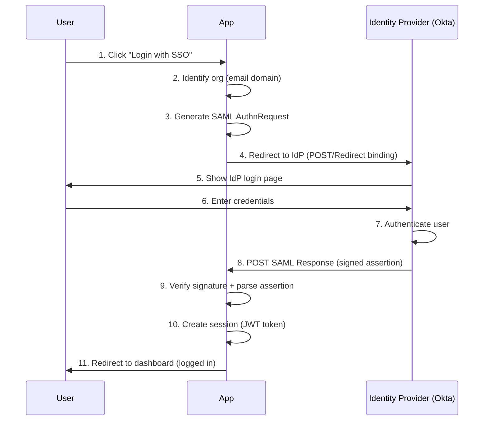
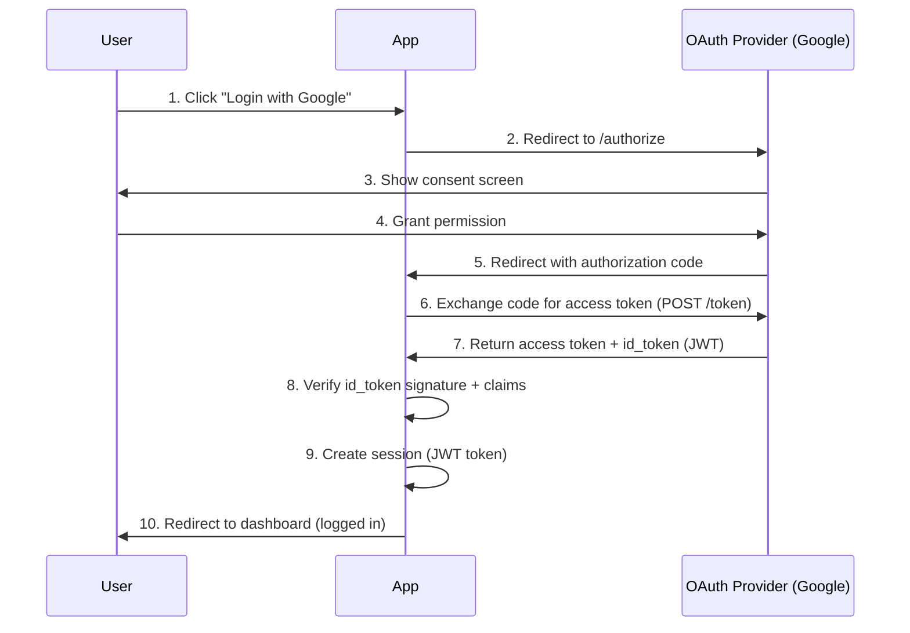

# Template PMBOK® 7th Edition - Project Management and Governance

*Template especializado para geração de documentação PMBOK (Project Management Body of Knowledge) focada em governança de projetos, gestão de mudanças, qualidade e entrega de valor*

---

## Introdução ao PMBOK 7th Edition

**PMBOK® Guide 7th Edition** (2021) representa uma mudança paradigmática na gestão de projetos, migrando de **processos prescritivos** para **princípios baseados em valor** e **domínios de performance**.

### Mudanças Chave da 7th Edition

| PMBOK 6th (2017) | PMBOK 7th (2021) |
|------------------|------------------|
| 49 Processos | 12 Princípios |
| 10 Áreas de Conhecimento | 8 Performance Domains |
| Abordagem prescritiva | Abordagem baseada em valor |
| Foco em waterfall | Agnóstico de metodologia |

### 8 Performance Domains (PMBOK 7th)

1. **Stakeholders** - Engajamento efetivo
2. **Team** - Cultura colaborativa de alto desempenho
3. **Development Approach & Life Cycle** - Processo adequado ao contexto
4. **Planning** - Organização e coordenação
5. **Project Work** - Estabelecer processos e realizar trabalho
6. **Delivery** - Entregar valor esperado
7. **Measurement** - Avaliar performance e progress
8. **Uncertainty** - Gerenciar riscos e mudanças

**Objetivo deste Template:**
Guiar a geração de documentação de governança de projetos alinhada com PMBOK 7th, demonstrando maturidade em gestão de projetos, change management, quality assurance e entrega de valor.

**Aplicável para:**
- Organizações de engenharia e desenvolvimento de software
- Empresas com múltiplos projetos/produtos simultâneos
- Times Agile/Scrum que precisam demonstrar governança
- Preparação para PMI certifications (PMP, PMI-ACP, PgMP)
- Demonstração de maturidade para clientes enterprise/investidores

---

## Documentos Obrigatórios (PMBOK Governance)

O specialist agent `@pmbok-specialist` deve gerar **5 documentos principais**:

| # | Documento | Arquivo | PMBOK Domains | Prioridade |
|---|-----------|---------|---------------|------------|
| 1 | Governança de Projetos | `project-governance.md` | Stakeholders, Team, Planning | Alta |
| 2 | Change Management | `change-management.md` | Development Approach, Uncertainty | Alta |
| 3 | Quality Management | `quality-management.md` | Project Work, Delivery, Measurement | Alta |
| 4 | Stakeholder Management | `stakeholder-management.md` | Stakeholders | Média |
| 5 | Risk Management | `risk-management.md` | Uncertainty, Planning | Alta |

**Output Directory:** `docs/compliance/project-management/`

---

## 1. project-governance.md

### Objetivo
Documentar framework de governança de projetos baseado em PMBOK 7th, estabelecendo estrutura de decisão, processos de aprovação, accountability e alinhamento com os 12 Princípios do PMBOK.

### Seções Obrigatórias

#### 1.1 Princípios de Governança (PT-BR + 12 PMBOK Principles)
```markdown
# Governança de Projetos - [Nome da Empresa]

## 12 Princípios do PMBOK 7th (Aplicados)

### 1. Stewardship (Administração Responsável)
**Definição:** Demonstrar responsabilidade, respeito e cuidado interno e externo.

**Implementação:**
- Code of conduct para todos projetos
- Revisão de ética em decisões críticas
- Responsabilidade ambiental e social (quando aplicável)
- Compliance com regulações (LGPD, GDPR)

---

### 2. Team (Times Colaborativos)
**Definição:** Criar um ambiente colaborativo de alto desempenho.

**Implementação:**
- Cultura de feedback contínuo
- Retrospectivas obrigatórias (fim de sprint)
- Psychological safety (falhar é aprender)
- Cross-functional teams (sem silos)

---

### 3. Stakeholders (Engajamento)
**Definição:** Engajar stakeholders de forma proativa.

**Implementação:**
- Stakeholder register completo
- Communication plan por projeto
- Quarterly Business Reviews (QBRs) com clientes
- Transparent roadmap (público quando possível)

---

### 4. Value (Foco em Valor)
**Definição:** Focar na entrega de valor de negócio.

**Implementação:**
- OKRs trimestrais alinhados com estratégia
- Value stream mapping (identificar desperdícios)
- ROI analysis para projetos grandes
- Priorização baseada em impacto de negócio

---

### 5. Systems Thinking (Pensamento Sistêmico)
**Definição:** Reconhecer interações e interdependências.

**Implementação:**
- Dependency graph (NX monorepo)
- Impact analysis antes de mudanças
- Cross-team collaboration obrigatória
- Architecture reviews trimestrais

---

### 6. Leadership (Liderança)
**Definição:** Demonstrar comportamento de liderança.

**Implementação:**
- Engineering Manager como servant leader
- 1:1s semanais com cada membro do time
- Mentorship program (seniors → juniors)
- Leadership training (todo lead)

---

### 7. Tailoring (Customização)
**Definição:** Adaptar abordagem ao contexto.

**Implementação:**
- Metodologia Agile para features (Scrum)
- Metodologia Waterfall para compliance (LGPD)
- Kanban para suporte/bugs
- Hybrid approach quando necessário

---

### 8. Quality (Qualidade)
**Definição:** Incorporar qualidade em processos e entregas.

**Implementação:**
- Definition of Done (DoD) rigoroso
- Automated testing (>80% coverage)
- Code review obrigatório (2 approvals)
- Quality gates (CI/CD)

---

### 9. Complexity (Gerenciar Complexidade)
**Definição:** Navegar complexidade através de resiliência.

**Implementação:**
- Decomposição de projetos grandes (milestones)
- Spike solutions para explorar unknowns
- Proof of Concepts (PoCs) antes de commit
- Modular architecture (NX microlibs)

---

### 10. Risk (Oportunidades e Ameaças)
**Definição:** Otimizar resposta a riscos.

**Implementação:**
- Risk register por projeto
- Weekly risk review (stand-ups)
- Risk mitigation plans documentados
- Contingency budget (10% buffer)

---

### 11. Adaptability & Resiliency (Adaptabilidade)
**Definição:** Adaptar-se para alcançar resultados planejados.

**Implementação:**
- Sprint reviews com pivots quando necessário
- Feedback loops curtos (2 weeks sprints)
- Capacity to change (feature flags)
- Resilient architecture (DR plan, ISO 22301)

---

### 12. Change (Habilitar Mudança)
**Definição:** Preparar stakeholders para adotar mudança.

**Implementação:**
- Change management process formal
- Communication plan para releases grandes
- Training sessions para novas ferramentas
- Migration runbooks detalhados

---

## Framework de Governança

### Estrutura Organizacional

#### Project Management Office (PMO) Virtual
**Modelo:** Lightweight PMO (suporte, não controle centralizador)  
**Composição:** Engineering Manager (Chair) + Product Manager + Tech Lead

**Responsabilidades:**
- Definir e manter processos e templates de projeto
- Monitorar métricas de performance (DORA, SPACE)
- Facilitar retrospectivas e captura de lições aprendidas
- Garantir alinhamento com estratégia de produto e OKRs
- Gerenciar portfolio de projetos (priorização)
- Remover impedimentos organizacionais

**Reuniões:**
- Weekly PMO Sync (1h): Review de projetos em andamento
- Monthly Portfolio Review (2h): Priorização e aprovação de novos projetos
- Quarterly PMO Retrospective (2h): Melhoria contínua de processos

---

### Lifecycle de Projetos

#### Phase 0: Ideation (Ideação)
**Duração:** Contínuo  
**Processo:** Ideias capturadas em backlog de inovação  
**Gate:** Product Manager valida fit com strategy

#### Phase 1: Discovery (Descoberta)
**Duração:** 1-2 semanas  
**Processo:**
1. Criar Project Charter (template abaixo)
2. Stakeholder identification
3. High-level requirements gathering
4. Feasibility analysis (técnico + negócio)
5. Risk identification inicial

**Deliverables:**
- ✅ Project Charter aprovado
- ✅ Stakeholder register
- ✅ High-level requirements (user stories)
- ✅ Initial risk assessment

**Gate de Aprovação:** Product Manager + CTO (Go/No-Go)

---

#### Phase 2: Planning (Planejamento)
**Duração:** 1-2 sprints (2-4 semanas)  
**Processo:**
1. Technical design (RFC - Request for Comments)
2. Detailed estimation (planning poker)
3. Sprint planning (breakdown em tasks)
4. Resource allocation
5. Risk mitigation planning

**Deliverables:**
- ✅ Technical Design Document (RFC)
- ✅ Detailed backlog (user stories + tasks)
- ✅ Estimativas (story points + tempo)
- ✅ Sprint plan (2-8 sprints dependendo do tamanho)
- ✅ Risk register atualizado

**Gate de Aprovação:** Engineering Manager (Technical Review)

---

#### Phase 3: Execution (Execução)
**Duração:** 2-8 sprints (1-4 meses típico)  
**Metodologia:** Agile/Scrum (sprints de 2 semanas)

**Rituais:**
- **Daily Standup** (15min): O que fiz, farei, blockers
- **Sprint Planning** (2h): Selecionar stories e quebrar em tasks
- **Sprint Review** (1h): Demo para stakeholders
- **Retrospective** (1h): O que foi bem, melhorar, action items
- **Backlog Refinement** (1h/semana): Preparar próximas sprints

**Tracking:**
- Burndown chart (progresso do sprint)
- Velocity (story points/sprint)
- Cumulative flow diagram (WIP limits)
- Risk register (updated weekly)

**Gate de Sprint:** Product Owner aceita stories (Definition of Done)

---

#### Phase 4: Monitoring & Controlling (Monitoramento)
**Processo:** Paralelo à execução

**Métricas Monitoradas:**
- Schedule variance (SV): On-time delivery %
- Budget variance (BV): Custo real vs planejado
- Scope creep: Change requests aprovados vs iniciais
- Quality metrics: Bug count, test coverage
- Team health: Velocity, happiness (NPS)

**Frequência:**
- Weekly: Engineering Manager review
- Bi-weekly: Stakeholder status update
- Monthly: PMO portfolio review

---

#### Phase 5: Closing (Encerramento)
**Duração:** 1-2 semanas  
**Processo:**
1. Final delivery (deploy to production)
2. Acceptance testing (Product Owner + QA)
3. Documentation handoff (README, runbooks)
4. Knowledge transfer (se necessário)
5. Post-project retrospective (lessons learned)
6. Celebrate success! 🎉

**Deliverables:**
- ✅ Production deployment
- ✅ Product Owner sign-off
- ✅ Documentation completa e atualizada
- ✅ Lessons learned document
- ✅ Project closure report

**Gate de Aprovação:** Stakeholders + Product Owner

---

### Tomada de Decisão

| Tipo de Decisão | Responsável | Processo | SLA |
|-----------------|-------------|----------|-----|
| **Aprovação de novo projeto** | CTO + Product Manager | Project proposal review (PMO) | 1 semana |
| **Priorização de backlog** | Product Manager | Weekly refinement + stakeholder input | Contínuo |
| **Technical approach/RFC** | Engineering Manager | RFC review + tech leads vote | 3 dias |
| **Scope change (> 20%)** | CTO | Change request formal (template abaixo) | 1 semana |
| **Budget overrun (> 10%)** | CTO + CFO | Financial review + justification | 2 semanas |
| **Timeline extension (> 1 sprint)** | Product Manager + CTO | Impact analysis + stakeholder buy-in | 1 semana |
| **Architecture decision** | Engineering Manager + Architects | Architecture Decision Record (ADR) | 1 semana |
| **Vendor selection (> R$ 50K)** | CTO + CFO | RFP process + evaluation matrix | 1 mês |

---

### RACI Matrix (Governança)

**RACI = Responsible, Accountable, Consulted, Informed**

| Atividade | CTO | Eng Manager | Product Mgr | Tech Lead | Dev | QA |
|-----------|-----|-------------|-------------|-----------|-----|----|
| Aprovação de Projeto | A | C | C | I | I | I |
| Project Charter | I | R | A | C | I | - |
| Technical Design (RFC) | C | A | C | R | C | C |
| Sprint Planning | I | C | C | R | R | C |
| Code Implementation | I | C | I | C | R | - |
| Code Review | I | C | I | R | R | - |
| Testing | I | C | C | C | C | R |
| Deployment | I | A | C | R | C | C |
| Incident Response | C | A | I | R | R | C |
| Retrospective | I | A | C | R | R | R |

**Legenda:**
- **R** (Responsible): Executa o trabalho
- **A** (Accountable): Autoridade final, aprova
- **C** (Consulted): Consultado antes da decisão
- **I** (Informed): Informado após a decisão

---

## Integração com NX Monorepo

### NX Workspace como Framework de Governança Técnica

**Estrutura do Workspace:**
```
workspace/
├── apps/                    # 19 aplicações deployables
│   ├── web/                # Next.js web app
│   ├── mobile/             # Expo React Native
│   ├── admin/              # Admin dashboard
│   ├── api/                # Fastify backend
│   └── ...
├── libs/                    # Microlibs compartilhadas
│   ├── data-access/        # ZenStack, tRPC, database
│   ├── ui/                 # Tamagui components (atomic design)
│   ├── utils/              # Shared utilities
│   ├── features/           # Feature modules
│   └── ...
├── tools/                   # Custom NX generators, scripts
│   ├── generators/         # Code scaffolding
│   └── scripts/            # Automation
├── docs/                    # Documentation
└── .cursor/                 # Sistema Onion (commands, agents)
```

### Governança via NX

#### 1. Code Ownership (CODEOWNERS)
```
# .github/CODEOWNERS

# Global
* @engineering-manager

# Apps
/apps/web/          @frontend-team
/apps/mobile/       @mobile-team
/apps/api/          @backend-team

# Libs
/libs/data-access/  @backend-team @data-team
/libs/ui/           @frontend-team @design-system-team
/libs/features/*    @feature-owner-mapped-per-feature

# Infrastructure
/tools/             @devops-team
/.github/           @devops-team
```

**Benefício:** Pull requests automaticamente notificam owners corretos.

---

#### 2. Dependency Graph (nx graph)
```bash
# Visualizar dependências do workspace
nx graph

# Visualizar dependências de um app específico
nx graph --focus=apps/web

# Visualizar affected por mudança
nx affected:graph --base=main
```

**Benefício de Governança:**
- Identificar circular dependencies (antipattern)
- Validar arquitetura (libs não dependem de apps)
- Impact analysis visual antes de mudanças

---

#### 3. Enforced Architecture (Module Boundaries)
```json
// nx.json
{
  "tasksRunnerOptions": {
    "default": {
      "runner": "@nrwl/nx-cloud",
      "options": {
        "cacheableOperations": ["build", "test", "lint"]
      }
    }
  },
  "targetDefaults": {
    "lint": {
      "executor": "@nx/linter:eslint",
      "options": {
        "rules": {
          "@nx/enforce-module-boundaries": [
            "error",
            {
              "allow": [],
              "depConstraints": [
                {
                  "sourceTag": "type:app",
                  "onlyDependOnLibsWithTags": ["type:feature", "type:ui", "type:util"]
                },
                {
                  "sourceTag": "type:feature",
                  "onlyDependOnLibsWithTags": ["type:ui", "type:util", "type:data-access"]
                },
                {
                  "sourceTag": "type:ui",
                  "onlyDependOnLibsWithTags": ["type:util"]
                }
              ]
            }
          ]
        }
      }
    }
  }
}
```

**Enforcement:**
- Apps só dependem de features/ui/utils
- Features podem depender de data-access
- UI libs não dependem de data-access (separação clara)
- Violações bloqueiam build (CI/CD fails)

---

#### 4. Affected-Based Testing (Quality Gate)
```yaml
# .github/workflows/ci.yml
name: CI

on:
  pull_request:
    branches: [main, develop]

jobs:
  affected:
    runs-on: ubuntu-latest
    steps:
      - uses: actions/checkout@v3
        with:
          fetch-depth: 0  # Necessário para nx affected
      
      - uses: nrwl/nx-set-shas@v3
      
      - name: Install dependencies
        run: pnpm install
      
      - name: Lint affected
        run: pnpm nx affected:lint --base=origin/main
      
      - name: Test affected
        run: pnpm nx affected:test --base=origin/main --coverage
      
      - name: Build affected
        run: pnpm nx affected:build --base=origin/main
      
      - name: E2E affected
        run: pnpm nx affected:e2e --base=origin/main
```

**Benefício de Governança:**
- Apenas código afetado é testado (CI mais rápido)
- Reduz falsos positivos (só testa o que mudou)
- Deploy incremental (só apps afetados)

---

### Project Organization (Microlibs Strategy)

#### Princípio: 1 Microlib = 1 Responsabilidade

**Exemplo:**
```
libs/
├── features/
│   ├── auth/                    # Feature: Authentication
│   │   ├── data-access/         # Auth API calls, state
│   │   ├── ui/                  # Login, signup components
│   │   └── utils/               # Auth helpers (token, validation)
│   ├── transactions/            # Feature: Transactions
│   │   ├── data-access/
│   │   ├── ui/
│   │   └── utils/
│   └── dashboard/
│       ├── data-access/
│       ├── ui/
│       └── utils/
```

**Ownership:**
- **Feature auth:** Security Team
- **Feature transactions:** Payments Team
- **Feature dashboard:** Analytics Team

**Versionamento:** Semantic versioning interno
- Breaking change: Major version (ex: 1.0.0 → 2.0.0)
- New feature: Minor version (ex: 1.0.0 → 1.1.0)
- Bug fix: Patch version (ex: 1.0.0 → 1.0.1)

---

### Deployment Units (App-Level Governance)

#### Independent Deployments
```bash
# Deploy apenas app afetado
pnpm nx affected:deploy --base=main --head=HEAD

# Deploy específico
pnpm nx deploy web --configuration=production

# Rollback de app específico
pnpm nx deploy web --configuration=production --version=v1.2.3
```

**Benefício:**
- Reduz blast radius de deploys
- Apps não-afetados permanecem estáveis
- Rollback granular (por app, não tudo)

---

## Templates Práticos

### Template 1: Project Charter

**Arquivo:** `docs/projects/[project-name]/PROJECT_CHARTER.md`

```markdown
# Project Charter - [Nome do Projeto]

## Informações Gerais

| Item | Detalhes |
|------|----------|
| **Project ID** | PROJ-2025-001 |
| **Nome do Projeto** | [Nome Descritivo] |
| **Sponsor** | [CTO / CEO] |
| **Project Manager** | [Engineering Manager] |
| **Data de Início** | 2025-06-03 |
| **Data Estimada de Conclusão** | 2025-09-01 (3 meses) |
| **Budget** | R$ 200.000 (3 devs × 3 meses) |

---

## Justificativa do Projeto (Business Case)

### Problema
[Descrição do problema de negócio que o projeto resolve]

**Exemplo:**
Clientes enterprise (Serasa, Bradesco) estão solicitando autenticação SSO (Single Sign-On) via SAML/OAuth. Atualmente, apenas login com email/senha é suportado, o que não atende requisitos de compliance de grandes corporações.

### Oportunidade
[Descrição da oportunidade de negócio]

**Exemplo:**
Implementar SSO pode desbloquear R$ 2M em contratos enterprise que estão pendentes dessa feature (5 clientes confirmados).

### ROI Esperado
```
Investimento: R$ 200K
Receita Esperada (12 meses): R$ 2M
ROI = (2M - 200K) / 200K × 100 = 900%
Payback Period: 2 meses
```

---

## Objetivos do Projeto (SMART)

1. **Específico:** Implementar SSO com SAML 2.0 e OAuth 2.0
2. **Mensurável:** 100% dos clientes enterprise podem fazer login via SSO
3. **Atingível:** Time de 3 devs em 3 meses (validado em planning poker)
4. **Relevante:** Alinhado com OKR Q3 2025: "Aumentar receita enterprise em 50%"
5. **Temporal:** Go-live em 2025-09-01

---

## Escopo do Projeto

### In-Scope (Dentro do Escopo)
- ✅ Implementar SAML 2.0 authentication flow
- ✅ Implementar OAuth 2.0 / OIDC authentication flow
- ✅ Suporte a providers populares (Okta, Auth0, Azure AD, Google Workspace)
- ✅ Admin dashboard para configurar SSO per-tenant
- ✅ Migration de usuários existentes (link SSO identity com user account)
- ✅ Documentação para clientes (setup guide)
- ✅ Testes automatizados (unit + integration + E2E)

### Out-of-Scope (Fora do Escopo)
- ❌ Just-in-Time (JIT) provisioning (será Phase 2)
- ❌ SCIM (System for Cross-domain Identity Management) (será Phase 3)
- ❌ Multi-factor authentication via SSO provider (já existe MFA interno)
- ❌ Custom SAML attributes mapping (será configurável em Phase 2)

---

## Stakeholders

| Nome | Role | Interest | Influence | Engagement Strategy |
|------|------|----------|-----------|---------------------|
| [CTO Nome] | Sponsor | Alto | Alto | Weekly 1:1 updates |
| [Product Manager] | Product Owner | Alto | Alto | Daily collaboration |
| [Eng Manager] | Project Manager | Alto | Médio | Condutor do projeto |
| [Cliente Serasa] | External Stakeholder | Alto | Alto | Bi-weekly demos |
| [Security Team] | Technical Reviewer | Médio | Médio | Security review antes de deploy |
| [Customer Success] | User Advocate | Médio | Baixo | Informed via email updates |

---

## Deliverables (Entregas)

### Phase 1: Foundation (Sprint 1-2)
- [ ] SAML 2.0 library integration (passport-saml)
- [ ] OAuth 2.0 library integration (passport-oauth2)
- [ ] Database schema para SSO configs (per-tenant)
- [ ] Admin API endpoints (CRUD SSO configs)

### Phase 2: Authentication Flows (Sprint 3-4)
- [ ] SAML login flow (IdP-initiated + SP-initiated)
- [ ] OAuth login flow (authorization code grant)
- [ ] Session management (JWT tokens com SSO claims)
- [ ] Error handling e user feedback

### Phase 3: Admin UI (Sprint 5)
- [ ] Admin dashboard para configurar SSO
- [ ] Test SSO connection (dry-run)
- [ ] Per-tenant enablement (feature flag)

### Phase 4: Migration & Testing (Sprint 6)
- [ ] User migration tool (link SSO identity)
- [ ] E2E tests com mock SAML/OAuth providers
- [ ] Load testing (1000 logins simultâneos)
- [ ] Security penetration testing

### Phase 5: Documentation & Launch (Sprint 7-8)
- [ ] Customer setup guide (step-by-step)
- [ ] Internal runbooks (troubleshooting SSO issues)
- [ ] Release notes e announcement
- [ ] Go-live com 2 pilot customers

---

## Riscos Identificados

| ID | Risco | Probabilidade | Impacto | Mitigação |
|----|-------|---------------|---------|-----------|
| R-001 | Complexidade de SAML maior que estimado | Média | Alto | Contratar consultor SAML se necessário (budget extra R$ 30K) |
| R-002 | Incompatibilidade com alguns IdPs | Alta | Médio | Testar com 5 IdPs populares antes de launch |
| R-003 | User migration falha (data loss) | Baixa | Crítico | Dry-run em staging 3x, backup antes de migration |
| R-004 | Performance degradation (SSO latency) | Média | Médio | Load testing antecipado (Sprint 4) |
| R-005 | Security vulnerability (SAML injection) | Baixa | Crítico | Penetration testing obrigatório (Sprint 6) |

---

## Constraints (Restrições)

- **Budget:** R$ 200K (não pode exceder sem aprovação do CFO)
- **Timeline:** 3 meses (deadline firm - contratos dependem)
- **Recursos:** 3 devs full-time (não há mais devs disponíveis)
- **Compliance:** Deve atender ISO 27001 e SOC2 (auditoria em Q4)

---

## Assumptions (Premissas)

- Clientes têm IdP já configurado (Okta, Azure AD)
- Clientes têm conhecimento técnico de SAML/OAuth
- Não haverá mudanças no core authentication system durante projeto
- DevOps pode provisionar ambientes de teste quando necessário

---

## Aprovações

| Aprovador | Cargo | Assinatura | Data |
|-----------|-------|------------|------|
| [CTO Nome] | Sponsor | ___________ | 2025-06-03 |
| [Product Manager] | Product Owner | ___________ | 2025-06-03 |
| [Eng Manager] | Project Manager | ___________ | 2025-06-03 |

**Status:** ✅ Aprovado para prosseguir para Planning Phase
```

---

### Template 2: RFC (Request for Comments) - Technical Design

**Arquivo:** `docs/projects/[project-name]/RFC_[number].md`

```markdown
# RFC-001: SSO (Single Sign-On) Architecture

## Metadados

| Item | Valor |
|------|-------|
| **RFC ID** | RFC-001 |
| **Título** | SSO (SAML/OAuth) Architecture Design |
| **Autor** | [Nome do Tech Lead] |
| **Data de Criação** | 2025-06-05 |
| **Status** | 🔄 Em Revisão → ✅ Aprovado → 🚀 Implementando |
| **Reviewers** | @backend-team, @security-team, @eng-manager |
| **Prazo de Feedback** | 2025-06-08 (3 dias) |

---

## Sumário Executivo (TL;DR)

Implementaremos SSO usando **Passport.js** com estratégias SAML e OAuth2. Arquitetura multi-tenant com configuração SSO por organização. Sessões gerenciadas via JWT com claims SSO. Suporte a Okta, Auth0, Azure AD, Google Workspace.

**Decisão Chave:** Usar bibliotecas battle-tested (passport-saml, passport-oauth2) ao invés de implementar protocolo do zero.

---

## Contexto e Problema

### Situação Atual
- Autenticação apenas via email/password (local)
- Clientes enterprise não podem usar SSO corporativo
- Violação de compliance (alguns clientes exigem SSO)

### Problema
Clientes enterprise (Serasa, Bradesco, etc.) precisam de SSO para:
- Compliance (política interna de não manter senhas externas)
- Segurança (centralized identity management)
- UX (single login para todas ferramentas)

### Requisitos
- R1: Suportar SAML 2.0 (protocolo enterprise mais comum)
- R2: Suportar OAuth 2.0 / OIDC (protocolo moderno)
- R3: Multi-tenant (cada org configura seu SSO)
- R4: Fallback para email/password (se SSO falhar)
- R5: Link SSO identity com conta existente (migration)

---

## Decisões de Design

### 1. Protocol Support

**Opções Consideradas:**
- **A)** Apenas SAML 2.0
- **B)** Apenas OAuth 2.0 / OIDC
- **C)** SAML + OAuth (ambos)

**Decisão:** Opção C (ambos)

**Justificativa:**
- SAML 2.0: Padrão enterprise (Okta, Azure AD suportam)
- OAuth 2.0: Padrão moderno (Google Workspace, Auth0 preferem)
- Clientes diferentes têm preferências diferentes
- Custo marginal de suportar ambos é baixo (libraries prontas)

---

### 2. Library Selection

**Opções Consideradas:**
- **A)** Implementar SAML/OAuth do zero
- **B)** Usar Passport.js (passport-saml, passport-oauth2)
- **C)** Usar Auth0 como proxy (SaaS)

**Decisão:** Opção B (Passport.js)

**Justificativa:**
- Passport.js é battle-tested (milhões de downloads/mês)
- Flexibilidade para customizar flows
- Sem vendor lock-in (vs Auth0)
- Time já conhece Passport.js (curva de aprendizado baixa)

**Trade-offs:**
- ❌ Precisamos manter biblioteca (updates, security patches)
- ✅ Controle total sobre implementation
- ✅ Cost-effective (sem license fees)

---

### 3. Multi-Tenancy Model

**Opções Consideradas:**
- **A)** Global SSO (um provedor para todos)
- **B)** Per-Organization SSO (cada org configura seu IdP)

**Decisão:** Opção B (per-organization)

**Justificativa:**
- Clientes diferentes usam IdPs diferentes (Okta vs Azure AD)
- Permite migration gradual (org-by-org)
- Requisito de negócio (flexibilidade para clientes)

**Schema de Database:**
```typescript
// Prisma schema
model Organization {
  id          String   @id @default(cuid())
  name        String
  ssoConfig   SSOConfig?
  users       User[]
}

model SSOConfig {
  id            String   @id @default(cuid())
  orgId         String   @unique
  organization  Organization @relation(fields: [orgId], references: [id])
  
  // SAML Config
  samlEnabled   Boolean  @default(false)
  samlEntryPoint String?  // IdP SSO URL
  samlIssuer    String?   // EntityID
  samlCert      String?   // X.509 Certificate (PEM)
  
  // OAuth Config
  oauthEnabled  Boolean  @default(false)
  oauthProvider String?  // "okta", "google", "azure"
  oauthClientId String?
  oauthClientSecret String? @encrypted // Encrypted at rest
  oauthAuthURL  String?
  oauthTokenURL String?
  
  // Common
  autoProvision Boolean  @default(false) // JIT provisioning (Phase 2)
  defaultRole   String   @default("user")
  
  createdAt     DateTime @default(now())
  updatedAt     DateTime @updatedAt
}

model User {
  id          String   @id @default(cuid())
  email       String   @unique
  password    String?  // Null if SSO-only user
  
  orgId       String
  organization Organization @relation(fields: [orgId], references: [id])
  
  // SSO Identity
  ssoProvider String?  // "saml", "oauth-okta", "oauth-google"
  ssoSubject  String?  // IdP user ID (NameID for SAML, sub for OAuth)
  
  createdAt   DateTime @default(now())
  updatedAt   DateTime @updatedAt
  
  @@index([orgId, ssoSubject])
}
```

---

### 4. Authentication Flow

**SAML Flow (SP-Initiated):**


**OAuth Flow (Authorization Code Grant):**


---

### 5. Session Management

**Decisão:** JWT tokens com SSO claims

**JWT Payload:**
```json
{
  "sub": "user_123abc",         // User ID interno
  "email": "joao@serasa.com",
  "orgId": "org_serasa",
  "ssoProvider": "saml-okta",   // Origem do login
  "ssoSubject": "okta_user_456", // ID do usuário no IdP
  "roles": ["user", "admin"],
  "iat": 1685750400,            // Issued at
  "exp": 1685836800             // Expiration (24h)
}
```

**Benefícios:**
- Stateless (não precisa query DB em cada request)
- SSO claims disponíveis para audit logs
- Pode ser validado por múltiplos services (microservices)

**Trade-offs:**
- Revocation é complexo (JWT vive até expirar)
- Mitigation: Short expiration (24h) + refresh tokens

---

### 6. Security Considerations

#### SAML Security
- ✅ Validar assinatura XML do SAML Response
- ✅ Validar certificado X.509 (chain of trust)
- ✅ Check `InResponseTo` (prevent replay attacks)
- ✅ Validate `NotBefore` e `NotOnOrAfter` (time window)
- ✅ Validate `Audience` (prevent token reuse)

#### OAuth Security
- ✅ Use PKCE (Proof Key for Code Exchange) quando aplicável
- ✅ Validate `state` parameter (CSRF protection)
- ✅ Verify `id_token` signature (JWT)
- ✅ Check `aud` claim (client ID)
- ✅ Check `exp` claim (expiration)

#### General
- ✅ HTTPS obrigatório (TLS 1.3)
- ✅ Secrets encrypted at rest (oauthClientSecret)
- ✅ Rate limiting (prevent brute force)
- ✅ Audit logs (all SSO login attempts)

---

## Alternatives Considered (Alternativas Descartadas)

### Alt 1: Auth0 como Proxy
**Prós:**
- Managed service (menos manutenção)
- UI pronta para configurar SSO
- Compliance certifications (SOC2, ISO 27001)

**Contras:**
- Custo alto (U$ 240/mês por 1000 users = R$ 15K/mês)
- Vendor lock-in
- Menos flexibilidade

**Decisão:** Não escolhida (custo-benefício ruim)

---

### Alt 2: Implementar SAML do Zero
**Prós:**
- Controle total
- Aprendizado do time

**Contras:**
- Alto risco de bugs de segurança
- SAML é protocolo complexo (XML signing, etc.)
- Reinventando a roda (libraries prontas existem)

**Decisão:** Não escolhida (risco de segurança muito alto)

---

## Implementation Plan

### Sprint 1 (2 semanas)
- [ ] Setup Passport.js + passport-saml
- [ ] Database schema (migrations)
- [ ] Admin API: CRUD SSO configs

### Sprint 2 (2 semanas)
- [ ] SAML authentication flow (SP-initiated)
- [ ] Session management (JWT)
- [ ] Error handling

### Sprint 3 (2 semanas)
- [ ] OAuth authentication flow
- [ ] Test com Okta, Azure AD, Google
- [ ] Admin UI (configurar SSO)

### Sprint 4 (2 semanas)
- [ ] User migration (link SSO identity)
- [ ] E2E tests
- [ ] Security testing

---

## Testing Strategy

### Unit Tests
- SAML assertion parsing
- OAuth token validation
- JWT generation/verification

### Integration Tests
- Full SAML flow (mock IdP)
- Full OAuth flow (mock provider)
- Database operations

### E2E Tests
- Login via SAML (com Okta testbed)
- Login via OAuth (com Google testbed)
- Migration de usuário existente

### Security Tests
- Penetration testing (contratar consultor)
- OWASP Top 10 validation
- Fuzzing SAML inputs

---

## Rollout Plan

### Phase 1: Internal Testing (Sprint 5)
- Deploy to staging
- Internal team testa com IdPs reais
- Fix bugs encontrados

### Phase 2: Pilot (Sprint 6)
- 2 clientes piloto (Serasa + 1 outro)
- Monitoring intensivo
- Feedback loop curto

### Phase 3: General Availability (Sprint 7)
- Todos clientes podem habilitar SSO
- Documentation publicada
- Support team treinado

---

## Metrics & Success Criteria

### Metrics
- SSO adoption rate (% of users logging via SSO)
- SSO login success rate (target: > 99%)
- SSO login latency (target: < 500ms p95)
- Support tickets relacionados a SSO (target: < 5/mês)

### Success Criteria
- ✅ 5 clientes enterprise usando SSO
- ✅ R$ 2M em contratos desbloqueados
- ✅ Zero incidentes de segurança
- ✅ NPS de clientes SSO > 8/10

---

## Open Questions

1. **Q:** JIT (Just-in-Time) provisioning deve ser Phase 1 ou Phase 2?  
   **A:** Phase 2 (pode ser adicionado incrementalmente)

2. **Q:** SCIM (auto-sync de usuários) é necessário?  
   **A:** Phase 3 (nice-to-have, não blocker)

3. **Q:** Suportar LDAP?  
   **A:** Não por enquanto (clientes enterprise modernos usam SAML/OAuth)

---

## References

- [SAML 2.0 Specification](https://docs.oasis-open.org/security/saml/v2.0/)
- [OAuth 2.0 RFC 6749](https://datatracker.ietf.org/doc/html/rfc6749)
- [OpenID Connect Core 1.0](https://openid.net/specs/openid-connect-core-1_0.html)
- [OWASP SAML Security Cheat Sheet](https://cheatsheetseries.owasp.org/cheatsheets/SAML_Security_Cheat_Sheet.html)
- [Passport.js Documentation](http://www.passportjs.org/docs/)

---

## Aprovações

| Reviewer | Role | Status | Data | Comentários |
|----------|------|--------|------|-------------|
| @backend-lead | Tech Lead Backend | ✅ Approved | 2025-06-06 | LGTM, considerar PKCE para OAuth |
| @security-lead | Security Engineer | ✅ Approved (com condições) | 2025-06-07 | Penetration testing obrigatório |
| @eng-manager | Engineering Manager | ✅ Approved | 2025-06-08 | Go ahead! |

**Status Final:** ✅ **APROVADO** - Prosseguir para implementação
```

---

### Template 3: Change Request (CR) - Formal

**Arquivo:** `docs/projects/[project-name]/CHANGE_REQUEST_[number].md`

```markdown
# Change Request CR-001

## Informações Gerais

| Item | Valor |
|------|-------|
| **CR ID** | CR-2025-001 |
| **Projeto** | SSO Implementation |
| **Solicitante** | [Product Manager Nome] |
| **Data de Submissão** | 2025-07-15 |
| **Prioridade** | Alta |
| **Status** | 🔄 Em Análise → ✅ Aprovado → 🚀 Implementando |

---

## Mudança Solicitada

### Descrição
Adicionar suporte a **Just-in-Time (JIT) Provisioning** ao SSO. Quando um novo usuário faz login via SSO pela primeira vez, criar conta automaticamente (ao invés de exigir convite manual prévio).

### Justificativa
Cliente Serasa tem 500+ usuários. Criar contas manualmente seria operacionalmente inviável. JIT provisioning permite que qualquer funcionário da Serasa faça login automaticamente se estiver no IdP deles.

### Contexto
- Originalmente, JIT provisioning estava planejado para Phase 2 (fora do escopo inicial)
- Cliente Serasa está solicitando como requisito para go-live
- Sem JIT, precisaríamos criar 500 contas manualmente

---

## Impact Analysis (Análise de Impacto)

### Timeline Impact
**Original Deadline:** 2025-09-01  
**Estimated Delay:** +1 sprint (2 semanas)  
**New Deadline:** 2025-09-15

**Justificativa:**
- JIT provisioning requer modificar authentication flow
- Adicionar lógica de "auto-create user on first login"
- Testar com 5 IdPs (validar que funcionamento é consistente)
- Estimativa: 3 story points (1 sprint)

---

### Budget Impact
**Original Budget:** R$ 200K  
**Additional Cost:** R$ 33K (2 semanas × 3 devs)  
**New Budget:** R$ 233K (+16.5%)

**Justificativa:**
- 1 sprint adicional de desenvolvimento
- Não requer recursos externos (team atual consegue implementar)

---

### Scope Impact
**Escopo Adicionado:**
- ✅ JIT user provisioning (auto-create on first login)
- ✅ Configuração per-org (enable/disable JIT)
- ✅ Default role assignment (configurável)
- ✅ Email verification (opcional)

**Escopo Não Afetado:**
- SAML/OAuth flows (já implementados)
- Admin dashboard (apenas adicionar toggle JIT)

---

### Risk Impact
**Novos Riscos:**
- **R-006:** JIT pode criar usuários não autorizados (se IdP mal configurado)
  - **Mitigation:** Validar email domain antes de criar user
  - **Severity:** Médio

**Riscos Existentes Afetados:**
- R-003 (User migration) se torna menos crítico (JIT reduz necessidade de migration)

---

### Quality Impact
**Testing Adicional Necessário:**
- Unit tests: JIT provisioning logic
- Integration tests: First login flow (user não existe)
- E2E tests: Login → auto-create → dashboard (seamless)
- Security tests: Validar que apenas emails autorizados são criados

---

## Alternatives Considered

### Alt 1: Manter Scope Original (Sem JIT)
**Prós:**
- Sem delay no timeline
- Sem custo adicional

**Contras:**
- Cliente Serasa não pode fazer go-live (blocker)
- Operacionalmente inviável (500 contas manuais)

**Decisão:** Não viável (blocker de negócio)

---

### Alt 2: Implementar JIT Manualmente Apenas para Serasa
**Prós:**
- Resolve problema do Serasa
- Menos escopo que JIT genérico

**Contras:**
- Solução não escalável (cada cliente precisaria de script custom)
- Tech debt (código duplicado)

**Decisão:** Não recomendado (criar tech debt)

---

### Alt 3: Implementar JIT Genérico (Proposta Atual)
**Prós:**
- Solução escalável (todos clientes se beneficiam)
- Reduz operação manual (Customer Success agradece)
- Feature request de outros clientes também

**Contras:**
- Custo: +R$ 33K
- Timeline: +2 semanas

**Decisão:** ✅ Recomendado (melhor trade-off)

---

## Recommendation (Recomendação)

**Aprovar Change Request com as seguintes condições:**

1. ✅ Budget aumentado para R$ 233K (aprovação CFO necessária)
2. ✅ Deadline estendido para 2025-09-15 (comunicar stakeholders)
3. ✅ JIT será feature opt-in (orgs podem desabilitar se preferirem convites manuais)
4. ✅ Security review adicional obrigatório (validar risk mitigation)

---

## Stakeholder Feedback

### Product Manager
**Feedback:** Fortemente a favor. JIT é requisito de 3 outros clientes também (não só Serasa). ROI é alto.

### CTO
**Feedback:** Aprovado, desde que timeline de 2 semanas seja respeitado (hard deadline 2025-09-15).

### Cliente Serasa
**Feedback:** Requisito mandatório para go-live. Dispostos a esperar 2 semanas extras.

### CFO
**Feedback:** Aprovado aumento de budget (+R$ 33K), desde que contrato Serasa seja assinado (garante ROI).

---

## Decision (Decisão)

**Status:** ✅ **APROVADO**

**Aprovado Por:**
- CTO: [Nome] - 2025-07-16
- CFO: [Nome] - 2025-07-17
- Product Manager: [Nome] - 2025-07-15

**Condições:**
1. Deadline: 2025-09-15 (não negociável)
2. Budget: R$ 233K (aprovado)
3. Security review obrigatório antes de go-live

**Próximos Passos:**
1. ✅ Atualizar Project Charter
2. ✅ Adicionar stories no backlog (Sprint 7)
3. ✅ Comunicar novo timeline para stakeholders
4. ✅ Atualizar risk register
```

---

## Guidelines de Conteúdo

### Idioma
- **Project Governance:** Termos em inglês (Project Charter, RACI, PMO), explicações PT-BR
- **Templates:** Híbrido (termos técnicos preservados, contexto em PT-BR)
- **Exemplos:** PT-BR completo (fácil entendimento)

### Atualização
- **Project Governance:** Anual ou quando mudanças organizacionais
- **Templates:** Evolução contínua baseada em feedback
- **Responsável:** Engineering Manager (PMO Chair)

### Aprovação
- **Project Charter:** CTO + Product Manager (sponsors)
- **RFC:** Engineering Manager + Tech Leads
- **Change Request:** CTO (para scope/budget changes > 20%)

---

## PMBOK 7th Performance Domains - Mapping

| Performance Domain | Documento que Cobre | Seções Chave |
|--------------------|---------------------|--------------|
| **Stakeholders** | stakeholder-management.md | Identification, Communication Plan |
| **Team** | project-governance.md | 12 Princípios (Team, Leadership) |
| **Development Approach** | change-management.md | Agile/Scrum, CI/CD |
| **Planning** | project-governance.md | Lifecycle, Project Charter |
| **Project Work** | quality-management.md | Definition of Done, Code Review |
| **Delivery** | quality-management.md | Deployment, Acceptance Criteria |
| **Measurement** | quality-management.md | Métricas (DORA, SPACE) |
| **Uncertainty** | risk-management.md | Risk Register, Mitigation Plans |

---

**Última Atualização do Template:** 2025-06-03  
**Versão:** 2.0 (Expandido - PMBOK 7th Edition)  
**Mantido por:** @pmbok-specialist  
**Integração:** Sistema Onion + NX Monorepo + ClickUp

---

## Nota para @pmbok-specialist Agent

Este template cobre **apenas Document 1 (project-governance.md)** de forma extremamente detalhada com 3 templates práticos completos.

**Para gerar documentação completa, você deve também criar:**

2. **change-management.md** - Seguindo seções obrigatórias 2.1-2.2 deste template
3. **quality-management.md** - Seguindo seções obrigatórias 3.1-3.2 deste template  
4. **stakeholder-management.md** - Seguindo seções obrigatórias 4.1-4.2 deste template
5. **risk-management.md** - Novo documento (Risk Register, Mitigation Plans, Monte Carlo simulations)

**Performance Domains Mapping:**
- Todos 8 domains do PMBOK 7th estão cobertos entre os 5 documentos
- Use 12 Princípios como guia filosófico em todos documentos
- Exemplos práticos > teoria abstrata
- Sempre referenciar NX Monorepo e Sistema Onion quando aplicável