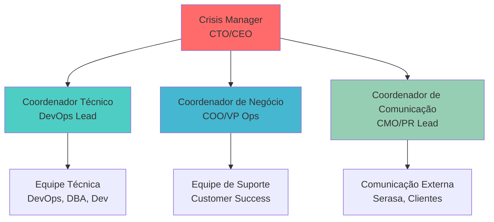
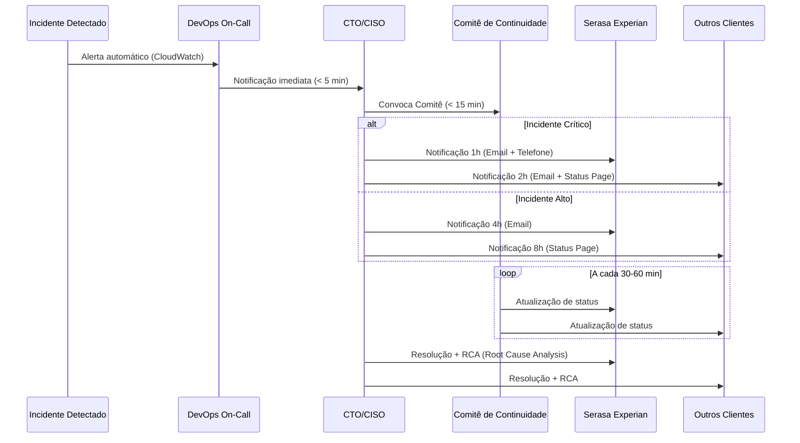

# Plano de Continuidade de Negócios (PCN/BCP)

## 📋 Controle de Versão

| Versão | Data | Autor | Descrição | Aprovador |
|--------|------|-------|-----------|-----------|
| 1.0 | [DATA] | [NOME - CARGO] | Versão inicial do PCN | [NOME - CEO/CTO] |
| 1.1 | [DATA] | [NOME - CARGO] | [DESCRIÇÃO DAS MUDANÇAS] | [NOME - CEO/CTO] |

---

## 📄 Sumário Executivo

Este Plano de Continuidade de Negócios (PCN) estabelece as estratégias, procedimentos e recursos necessários para garantir a continuidade das operações críticas de **[NOME DA EMPRESA]** em caso de interrupções, desastres ou crises que possam impactar a capacidade de entrega de serviços aos clientes, incluindo **Serasa Experian**.

O PCN foi desenvolvido em conformidade com a norma **ISO 22301:2019** (Business Continuity Management System) e contempla:

-  Análise de Impacto nos Negócios (BIA)
-  Estratégias de continuidade para processos críticos
-  Objetivos de Tempo de Recuperação (RTO) e Ponto de Recuperação (RPO)
-  Procedimentos de ativação e gestão de continuidade
-  Estrutura de comunicação com stakeholders, incluindo Serasa Experian
-  Cronograma de manutenção e testes

**Objetivo:** Minimizar o impacto de interrupções e garantir a retomada dos serviços dentro dos prazos estabelecidos contratualmente.

---

## 🎯 1. Objetivo e Escopo do PCN

### 1.1 Objetivo

Estabelecer um framework robusto e testado para:
- Proteger a vida e segurança dos colaboradores
- Minimizar impactos financeiros, reputacionais e operacionais
- Garantir a continuidade de processos críticos de negócio
- Atender aos requisitos contratuais com clientes (ex: Serasa Experian)
- Cumprir obrigações regulatórias e de compliance

### 1.2 Escopo

Este PCN cobre:

**Processos de Negócio:**
- Todos os processos críticos identificados na Análise de Impacto (BIA)
- Serviços fornecidos aos clientes enterprise (incluindo Serasa Experian)
- Operações de TI e infraestrutura tecnológica
- Funções de suporte essenciais (RH, Financeiro, Jurídico)

**Localidades:**
- [ENDEREÇO ESCRITÓRIO PRINCIPAL]
- [ENDEREÇO SITE SECUNDÁRIO / DR SITE]
- Trabalho remoto (home office)

**Recursos:**
- Infraestrutura tecnológica (data centers, cloud, redes)
- Sistemas e aplicações críticas
- Pessoas (colaboradores e fornecedores críticos)
- Instalações físicas

**Exclusões:**
- Processos não críticos (identificados na BIA com prioridade baixa)
- Instalações de parceiros/fornecedores (cobertos por seus próprios PCNs)

### 1.3 Interdependências com Serasa Experian

**[NOME DA EMPRESA]** fornece os seguintes serviços à Serasa Experian:
- [SERVIÇO 1 - ex: APIs de consulta de dados]
- [SERVIÇO 2 - ex: Processamento de transações]
- [SERVIÇO 3 - ex: Relatórios e analytics]

**Dependências Críticas:**
- SLA de disponibilidade: **99.9%**
- RTO contratual: **≤ 2 horas** (serviços core)
- RPO contratual: **≤ 15 minutos** (perda máxima de dados)

---

## 📊 2. Análise de Impacto nos Negócios (BIA)

### 2.1 Processos Críticos Priorizados

A tabela abaixo apresenta os processos críticos identificados, ordenados por prioridade:

| # | Processo de Negócio | Prioridade | MTD* | RTO | RPO | Impacto Financeiro | Impacto Reputacional |
|---|---------------------|------------|------|-----|-----|-------------------|---------------------|
| 1 | **Autenticação e Autorização** | Crítica | 30 min | 30 min | 5 min | Alto (R$ [VALOR]/hora) | Muito Alto |
| 2 | **APIs Core de Transação** | Crítica | 1 hora | 1 hora | 15 min | Muito Alto (R$ [VALOR]/hora) | Muito Alto |
| 3 | **Processamento de Dados Cliente** | Crítica | 2 horas | 2 horas | 15 min | Alto (R$ [VALOR]/hora) | Alto |
| 4 | **Banco de Dados Transacional** | Crítica | 1 hora | 1 hora | 5 min | Muito Alto (R$ [VALOR]/hora) | Muito Alto |
| 5 | **Monitoramento e Alertas** | Alta | 4 horas | 4 horas | 30 min | Médio | Alto |
| 6 | **Suporte ao Cliente (Tier 1)** | Alta | 8 horas | 8 horas | N/A | Médio | Alto |
| 7 | **Backup e Restore** | Alta | 24 horas | 24 horas | 0 | Médio | Médio |
| 8 | **Funções Administrativas** | Média | 48 horas | 48 horas | 4 horas | Baixo | Baixo |

**\*MTD (Maximum Tolerable Downtime):** Tempo máximo que o processo pode ficar inativo antes de causar danos irreversíveis ao negócio.

**Nota:** RTOs e RPOs estão alinhados com SLAs contratuais da Serasa Experian e demais clientes enterprise.

### 2.2 Impactos Detalhados

#### 2.2.1 Impactos Financeiros

**Perda de Receita:**
- Transações não processadas: **R$ [VALOR]/hora**
- Penalidades contratuais (SLA breach): **[%] da receita mensal**
- Créditos de serviço a clientes: **[%] do valor contratual**

**Custos de Recuperação:**
- Ativação de DR Site: **R$ [VALOR]**
- Horas extras da equipe: **R$ [VALOR]/dia**
- Consultoria especializada: **R$ [VALOR]/dia**

#### 2.2.2 Impactos Reputacionais

- **Perda de confiança de clientes enterprise** (Serasa, etc.)
- **Cobertura negativa na mídia** especializada em tecnologia
- **Risco de rescisão contratual** por descumprimento de SLA
- **Dificuldade em aquisição de novos clientes** enterprise

#### 2.2.3 Impactos Operacionais

- **Interrupção de serviços** aos clientes finais
- **Acúmulo de backlog** de transações
- **Sobrecarga da equipe técnica** durante recuperação
- **Aumento de chamados de suporte** (até 300% do normal)

#### 2.2.4 Impactos Regulatórios/Legais

- **Violação de SLAs contratuais** (multas e penalidades)
- **Não conformidade com LGPD** (se houver perda de dados pessoais)
- **Possibilidade de ações judiciais** por danos causados

---

## 🛡️ 3. Estratégias de Continuidade

### 3.1 Estratégia Geral

**[NOME DA EMPRESA]** adota uma abordagem de continuidade em **múltiplas camadas**:

1. **Prevenção:** Controles proativos para evitar interrupções
2. **Detecção:** Monitoramento 24/7 e alertas automáticos
3. **Resposta:** Procedimentos de resposta rápida
4. **Recuperação:** Ativação de recursos alternativos
5. **Retomada:** Retorno ao estado normal de operação

### 3.2 Soluções Alternativas por Processo

#### 3.2.1 Processo: Autenticação e Autorização

**Solução Primária:**
- Serviço de autenticação em **cluster multi-AZ** (AWS us-east-1)
- Load balancer com health checks automáticos
- Failover automático para instâncias saudáveis

**Solução Alternativa (Contingência):**
- Failover para **região secundária** (AWS us-west-2) via Route53
- RTO: 30 minutos (ativação manual se automático falhar)
- Capacidade: 100% da carga normal

**Recursos Necessários:**
- **Pessoas:** 2 engenheiros DevOps (on-call 24/7)
- **Tecnologia:** AWS Route53, ALB, EC2 Auto Scaling, RDS Multi-AZ
- **Instalações:** Cloud-only (sem dependência física)

#### 3.2.2 Processo: APIs Core de Transação

**Solução Primária:**
- APIs em **containers Kubernetes** (EKS) multi-AZ
- Auto-scaling baseado em CPU/memória
- Circuit breakers e retry policies

**Solução Alternativa (Contingência):**
- **DR Site** em região secundária (us-west-2)
- Replicação ativa-passiva com RDS read replicas
- Ativação via runbooks documentados
- RTO: 1 hora (automático via alarmes CloudWatch)

**Recursos Necessários:**
- **Pessoas:** 3 engenheiros backend + 2 DevOps
- **Tecnologia:** AWS EKS, RDS, ElastiCache, S3, CloudFront
- **Instalações:** Cloud-only

#### 3.2.3 Processo: Banco de Dados Transacional

**Solução Primária:**
- **Amazon RDS Multi-AZ** (PostgreSQL) com failover automático
- Backup automatizado a cada 15 minutos
- Replicação síncrona para standby

**Solução Alternativa (Contingência):**
- **Read Replica** promovida a master (se Multi-AZ falhar)
- Restore de snapshot + point-in-time recovery
- RTO: 1 hora (promoção manual + validação)
- RPO: 5 minutos (último backup automático)

**Recursos Necessários:**
- **Pessoas:** 2 DBAs + 1 DevOps
- **Tecnologia:** RDS PostgreSQL 14+, AWS Backup
- **Instalações:** Cloud-only

#### 3.2.4 Processo: Suporte ao Cliente

**Solução Primária:**
- Equipe de suporte em **horário comercial** (9h-18h)
- Sistema de tickets (Zendesk/Freshdesk)
- SLA de resposta: 4 horas (issues normais), 1 hora (críticos)

**Solução Alternativa (Contingência):**
- **Trabalho remoto** total da equipe (home office)
- Ativação de suporte 24/7 em caso de crise
- Uso de celulares corporativos e VPN

**Recursos Necessários:**
- **Pessoas:** 5 analistas de suporte + 1 coordenador
- **Tecnologia:** VPN, Zendesk, Slack, telefonia VoIP
- **Instalações:** Home office (equipamento fornecido pela empresa)

### 3.3 Recursos Críticos

#### 3.3.1 Pessoas-Chave

| Papel | Nome | Contato Principal | Contato Secundário | Backup |
|-------|------|-------------------|-------------------|--------|
| **CTO** | [NOME] | [CELULAR] | [EMAIL] | [NOME BACKUP] |
| **CISO** | [NOME] | [CELULAR] | [EMAIL] | [NOME BACKUP] |
| **DevOps Lead** | [NOME] | [CELULAR] | [EMAIL] | [NOME BACKUP] |
| **DBA Lead** | [NOME] | [CELULAR] | [EMAIL] | [NOME BACKUP] |
| **Suporte Lead** | [NOME] | [CELULAR] | [EMAIL] | [NOME BACKUP] |

**Dependências:**
- Mínimo de **30% da equipe** técnica disponível para ativação do PCN
- On-call 24/7 para DevOps e DBA (escala semanal)
- Treinamento anual de todos os membros-chave

#### 3.3.2 Tecnologia Crítica

| Sistema/Aplicação | Provedor | Criticidade | Alternativa | RTO |
|-------------------|----------|-------------|-------------|-----|
| **AWS Cloud** | Amazon Web Services | Crítica | GCP/Azure (longo prazo) | N/A |
| **GitHub** | GitHub Inc. | Alta | GitLab self-hosted | 24h |
| **Slack** | Slack Technologies | Média | Microsoft Teams | 4h |
| **Zendesk** | Zendesk Inc. | Média | Email temporário | 8h |

#### 3.3.3 Fornecedores Críticos

| Fornecedor | Serviço | Contato | SLA | Plano de Contingência |
|------------|---------|---------|-----|----------------------|
| **AWS** | Cloud Infrastructure | [ACCOUNT MANAGER] | 99.99% | Multi-region failover |
| **[ISP Principal]** | Internet/Fibra | [SUPORTE 24/7] | 99.9% | [ISP Backup] (4G/5G) |
| **[Data Center]** | Colocation (se aplicável) | [NOC 24/7] | 99.95% | Migração para cloud |

---

## 🚨 4. Estrutura de Ativação e Gestão

### 4.1 Critérios de Ativação do PCN

O PCN deve ser ativado quando ocorrer um dos seguintes eventos:

#### 4.1.1 Ativação Automática (Imediata)

-  **Indisponibilidade total** de serviços críticos por **> 15 minutos**
-  **Perda de data center** principal (desastre natural, incêndio, etc.)
-  **Ataque cibernético** de grande escala (ransomware, DDoS massivo)
-  **Falha cascata** afetando múltiplos serviços simultaneamente

#### 4.1.2 Ativação Manual (Avaliação Requerida)

- 🟡 **Degradação de performance** crítica (> 50% de latência)
- 🟡 **Perda parcial** de serviços não críticos
- 🟡 **Ameaça iminente** identificada (furacão, greve, pandemia)
- 🟡 **Incidente de segurança** contido mas com potencial de escalada

#### 4.1.3 Quem Pode Ativar

**Autoridade para Ativação:**
1. **CTO / CISO** (decisão final)
2. **DevOps Lead / On-Call** (ativação imediata em emergências)
3. **Crisis Manager** (quando designado)

**Processo de Ativação:**
```
1. Identificar evento crítico
2. Notificar CTO/CISO (se tempo permitir)
3. Declarar ativação do PCN (verbal + Slack #incidents)
4. Convocar Comitê de Continuidade
5. Iniciar procedimentos de recuperação
6. Notificar Serasa Experian (dentro de 1 hora)
```

### 4.2 Comitê de Continuidade

#### 4.2.1 Estrutura do Comitê



#### 4.2.2 Papéis e Responsabilidades (Matriz RACI)

| Atividade | Crisis Manager | Coord. Técnico | Coord. Negócio | Coord. Comunicação | Equipe Técnica | Suporte |
|-----------|----------------|----------------|----------------|-------------------|----------------|---------|
| **Declarar ativação PCN** | **A** | C | C | I | I | I |
| **Executar failover técnico** | I | **A** | I | I | **R** | I |
| **Notificar Serasa** | A | C | C | **R** | I | C |
| **Atualizar clientes** | I | I | C | **A** | I | **R** |
| **Monitorar recuperação** | **A** | **R** | C | I | **R** | C |
| **Restaurar sistemas** | I | **A** | I | I | **R** | I |
| **Documentar incidente** | A | **R** | **R** | **R** | C | C |
| **Declarar retorno ao normal** | **A** | C | C | **R** | I | I |

**Legenda:**
- **R** = Responsible (Responsável por executar)
- **A** = Accountable (Autoridade final de aprovação)
- **C** = Consulted (Deve ser consultado)
- **I** = Informed (Deve ser informado)

#### 4.2.3 Sala de Crise (War Room)

**Física (se possível):**
- Localização: [SALA DE REUNIÃO X - ENDEREÇO]
- Equipamentos: Projetor, whiteboards, telefones, computadores

**Virtual (padrão atual):**
- **Slack:** Canal `#crisis-war-room` (criado automaticamente)
- **Google Meet:** Reunião permanente (link: `[URL]`)
- **Confluence:** Página de incident tracking (link: `[URL]`)
- **CloudWatch:** Alarmes, métricas e timeline de eventos

**Frequência de Reuniões durante Crise:**
- **A cada 30 minutos** nos primeiros 2 horas
- **A cada 1 hora** até resolução
- **A cada 4 horas** durante recuperação/normalização

---

## 📋 5. Procedimentos de Continuidade

### 5.1 Procedimento 1: Falha Completa do Data Center Principal

#### Cenário
- Data center AWS us-east-1 completamente indisponível
- Todos os serviços críticos afetados
- Necessidade de failover para us-west-2

#### Checklist de Ativação

**Fase 1: Avaliação e Declaração (0-15 min)**

- [ ] **[DevOps On-Call]** Confirmar indisponibilidade total via dashboards
- [ ] **[DevOps On-Call]** Verificar status oficial AWS (status.aws.amazon.com)
- [ ] **[DevOps On-Call]** Notificar CTO/CISO via CloudWatch Alarm + Slack + Celular
- [ ] **[CTO]** Declarar ativação do PCN (Slack #incidents)
- [ ] **[CTO]** Convocar Comitê de Continuidade (Google Meet)

**Fase 2: Failover Técnico (15-60 min)**

- [ ] **[DevOps Lead]** Executar script de failover: `./scripts/failover-to-west.sh`
- [ ] **[DevOps]** Promover RDS read replica em us-west-2 a master
- [ ] **[DevOps]** Atualizar Route53 para apontar para us-west-2
- [ ] **[DevOps]** Validar conectividade de todos os serviços
- [ ] **[DBA]** Verificar integridade de dados pós-failover
- [ ] **[QA]** Executar smoke tests dos fluxos críticos

**Fase 3: Comunicação (Paralelo, 0-60 min)**

- [ ] **[Comunicação]** Notificar Serasa Experian (dentro de 1 hora):
  - Email: `[EMAIL CONTATO SERASA]`
  - Telefone: `[TELEFONE CONTATO SERASA]`
  - Template: Ver seção 7.1
- [ ] **[Comunicação]** Atualizar status page: `status.[nomedaempresa].com`
- [ ] **[Suporte]** Preparar respostas para tickets esperados
- [ ] **[Comunicação]** Notificar demais clientes enterprise (dentro de 2 horas)

**Fase 4: Monitoramento e Estabilização (1-4 horas)**

- [ ] **[DevOps]** Monitorar métricas de performance (CPU, memória, latência)
- [ ] **[Suporte]** Monitorar volume de tickets/chamados
- [ ] **[DevOps Lead]** Reunião de status a cada 30 min com Comitê
- [ ] **[CTO]** Decidir se permanece em us-west-2 ou aguarda us-east-1

**Fase 5: Normalização (4-24 horas)**

- [ ] **[DevOps]** Planejar failback para us-east-1 (quando disponível)
- [ ] **[CTO]** Aprovar janela de manutenção para failback
- [ ] **[Comunicação]** Notificar clientes sobre failback programado
- [ ] **[DevOps]** Executar failback em horário de baixa utilização
- [ ] **[CTO]** Declarar retorno ao estado normal de operação
- [ ] **[Todos]** Preencher relatório de incidente (template na seção 8.2)

#### Scripts de Automação

**Script:** `failover-to-west.sh`
```bash
#!/bin/bash
# Failover automático para região secundária (us-west-2)
# Requisitos: AWS CLI configurado

set -e

echo "=== Iniciando Failover para us-west-2 ==="

# 1. Promover RDS read replica
aws rds promote-read-replica \
  --db-instance-identifier prod-db-west-replica \
  --region us-west-2

# 2. Atualizar Route53 DNS
aws route53 change-resource-record-sets \
  --hosted-zone-id Z1234567890ABC \
  --change-batch file://dns-failover.json

# 3. Escalar aplicações em us-west-2
kubectl scale deployment api-backend \
  --replicas=10 --context=west-cluster

# 4. Validar health checks
./scripts/validate-health-checks.sh us-west-2

echo "=== Failover concluído. Validar manualmente! ==="
```

**Nota:** Scripts completos em: `/docs/runbooks/failover/`

---

### 5.2 Procedimento 2: Ataque Cibernético (Ransomware)

#### Cenário
- Ransomware detectado em servidores/workstations
- Risco de criptografia de dados críticos
- Necessidade de isolamento e recuperação

#### Checklist de Ativação

**Fase 1: Contenção Imediata (0-30 min)**

- [ ] **[CISO]** Declarar "Security Incident - PCN Ativado"
- [ ] **[Security Team]** Isolar sistemas afetados (desconectar rede)
- [ ] **[DevOps]** Bloquear tráfego suspeito via Security Groups
- [ ] **[DevOps]** Desabilitar contas de usuário comprometidas
- [ ] **[CISO]** Preservar evidências (snapshots, logs) para análise forense
- [ ] **[CTO]** Convocar Comitê de Continuidade + Advogado

**Fase 2: Avaliação de Impacto (30-60 min)**

- [ ] **[Security/DBA]** Identificar sistemas criptografados
- [ ] **[DBA]** Verificar integridade de backups recentes
- [ ] **[DevOps]** Avaliar se é possível restaurar de backups (RPO aceitável?)
- [ ] **[CISO]** Decidir: (A) Restaurar de backup, ou (B) Negociar resgate (NÃO RECOMENDADO)
- [ ] **[Jurídico]** Avaliar necessidade de comunicação à ANPD (LGPD - 72h)

**Fase 3: Recuperação (1-8 horas)**

- [ ] **[DevOps]** Provisionar infraestrutura limpa (novos servers/containers)
- [ ] **[DBA]** Restaurar banco de dados do último backup validado
- [ ] **[DevOps]** Implantar aplicações de código-fonte confiável (Git)
- [ ] **[Security]** Executar scan completo de malware
- [ ] **[QA]** Validar integridade de dados restaurados
- [ ] **[DevOps Lead]** Liberar ambiente de produção restaurado

**Fase 4: Comunicação e Pós-Incidente**

- [ ] **[CISO]** Notificar Serasa Experian e clientes (transparência)
- [ ] **[Jurídico]** Comunicar ANPD se houver vazamento de dados pessoais
- [ ] **[CISO]** Contratar análise forense externa (se necessário)
- [ ] **[Security Team]** Implementar remediações de segurança identificadas
- [ ] **[CISO]** Documentar lessons learned

---

### 5.3 Procedimento 3: Indisponibilidade de Pessoal-Chave

#### Cenário
- Múltiplos membros da equipe técnica indisponíveis (doença, acidente, etc.)
- Conhecimento crítico concentrado em poucas pessoas

#### Checklist de Ativação

- [ ] **[RH/Manager]** Avaliar disponibilidade de backups designados
- [ ] **[CTO]** Ativar esquema de on-call estendido (12h shifts)
- [ ] **[RH]** Contratar consultores externos emergenciais (se > 50% da equipe afetada)
- [ ] **[Manager]** Priorizar apenas atividades críticas (postpone features)
- [ ] **[CTO]** Comunicar situação aos clientes (transparência, sem detalhes sensíveis)
- [ ] **[RH]** Documentar conhecimento crítico urgentemente (pair programming, docs)

---

## 📞 7. Comunicação e Interface com Serasa Experian

### 7.1 Matriz de Comunicação com Serasa

| Tipo de Evento | Prazo para Notificação | Canal | Contato Serasa | Responsável Interno |
|----------------|------------------------|-------|----------------|-------------------|
| **Incidente Crítico** (SLA breach iminente) | **1 hora** | Email + Telefone | [NOME - CARGO]<br/>[EMAIL]<br/>[TELEFONE] | [CISO/CTO] |
| **Incidente Alto** (degradação de serviço) | **4 horas** | Email | [EMAIL CONTATO] | [DevOps Lead] |
| **Manutenção Programada** (com downtime) | **72 horas** (antecedência) | Email + Portal | [EMAIL CONTATO] | [CTO] |
| **Testes de DR/BC** | **1 semana** (antecedência) | Email | [EMAIL CONTATO] | [CTO] |
| **Atualização de Contatos** | **Imediato** | Email | [EMAIL RH SERASA] | [RH] |

### 7.2 Template de Notificação de Incidente

```
Para: [EMAIL CONTATO SERASA]
CC: [EMAIL SECUNDÁRIO SERASA], [CTO INTERNO]
Assunto: [URGENTE] Notificação de Incidente - [NOME DA EMPRESA] - [DATA/HORA]

Prezado(a) [NOME CONTATO SERASA],

Informamos que um incidente está em andamento em nossa infraestrutura:

━━━━━━━━━━━━━━━━━━━━━━━━━━━━━━━━━━
📋 INFORMAÇÕES DO INCIDENTE
━━━━━━━━━━━━━━━━━━━━━━━━━━━━━━━━━━

🆔 ID do Incidente: INC-[YYYYMMDD]-[NNN]
📅 Data/Hora Início: [DD/MM/YYYY HH:MM UTC-3]
🚨 Severidade: [Crítica/Alta/Média]
📊 Status Atual: [Em Investigação/Em Resolução/Resolvido]

━━━━━━━━━━━━━━━━━━━━━━━━━━━━━━━━━━
🎯 IMPACTO
━━━━━━━━━━━━━━━━━━━━━━━━━━━━━━━━━━

Serviços Afetados:
  - [SERVIÇO 1]: [Indisponível/Degradado/Normalizado]
  - [SERVIÇO 2]: [Indisponível/Degradado/Normalizado]

Impacto nos SLAs:
  - Disponibilidade: [SIM/NÃO] - [Descrição]
  - RTO: [Dentro/Fora do SLA] - ETA: [HH:MM]

━━━━━━━━━━━━━━━━━━━━━━━━━━━━━━━━━━
🔧 AÇÕES EM ANDAMENTO
━━━━━━━━━━━━━━━━━━━━━━━━━━━━━━━━━━

1. [Ação 1 - Status]
2. [Ação 2 - Status]
3. [Ação 3 - Status]

ETA de Resolução: [DD/MM/YYYY HH:MM UTC-3]

━━━━━━━━━━━━━━━━━━━━━━━━━━━━━━━━━━
📞 CONTATO PARA ACOMPANHAMENTO
━━━━━━━━━━━━━━━━━━━━━━━━━━━━━━━━━━

Incident Manager: [NOME]
Email: [EMAIL]
Telefone: [TELEFONE]
Status Page: https://status.[nomedaempresa].com

Próxima Atualização: Em [30 minutos/1 hora]

━━━━━━━━━━━━━━━━━━━━━━━━━━━━━━━━━━

Atenciosamente,
[NOME DO RESPONSÁVEL]
[CARGO]
[NOME DA EMPRESA]
```

### 7.3 Fluxo de Comunicação



---

## 🧪 8. Manutenção e Testes

### 8.1 Cronograma de Revisões

| Atividade | Frequência | Responsável | Última Execução | Próxima Execução |
|-----------|------------|-------------|----------------|------------------|
| **Revisão completa do PCN** | Anual | CISO + CTO | [DATA] | [DATA + 1 ANO] |
| **Atualização de contatos** | Trimestral | RH + CISO | [DATA] | [DATA + 3 MESES] |
| **Teste de Tabletop Exercise** | Trimestral | CISO | [DATA] | [DATA + 3 MESES] |
| **Teste de DR Simulado** | Semestral | DevOps Lead | [DATA] | [DATA + 6 MESES] |
| **Teste de DR Completo** | Anual | CTO + DevOps | [DATA] | [DATA + 1 ANO] |
| **Treinamento de equipe** | Anual | RH + CISO | [DATA] | [DATA + 1 ANO] |

### 8.2 Plano de Testes Anuais

#### 8.2.1 Teste de Tabletop Exercise (Trimestral)

**Objetivo:** Validar conhecimento da equipe sobre procedimentos do PCN

**Metodologia:**
1. Reunião de 2-3 horas com Comitê de Continuidade
2. Apresentação de cenário hipotético (ex: "Data center pegando fogo")
3. Discussão em grupo: "O que fazemos? Quem faz? Quando?"
4. Documentar gaps identificados

**Participantes:**
- Obrigatório: CTO, CISO, DevOps Lead, DBA Lead
- Opcional: CEO, COO, representantes de equipes

**Próximo Teste:** [DATA]

#### 8.2.2 Teste de DR Simulado (Semestral)

**Objetivo:** Executar failover técnico para DR site (ambiente de staging)

**Metodologia:**
1. Janela de manutenção programada (fora do horário comercial)
2. Executar scripts de failover para ambiente de DR
3. Validar funcionamento de todos os serviços críticos
4. Medir RTO e RPO alcançados
5. Executar failback

**Duração:** 4-6 horas

**Próximo Teste:** [DATA]

#### 8.2.3 Teste de DR Completo (Anual)

**Objetivo:** Failover REAL para DR site em ambiente de produção

**Metodologia:**
1. Comunicar clientes com 1 semana de antecedência
2. Janela de manutenção de 4 horas (madrugada de sábado/domingo)
3. Executar failover completo us-east-1 → us-west-2
4. Operar em us-west-2 por 24-48 horas
5. Executar failback para us-east-1
6. Gerar relatório de teste (template: seção 8.3)

**Próximo Teste:** [DATA]

### 8.3 Template de Relatório de Teste

Ver documento: **[05-relatorio-testes-anuais.md](05-relatorio-testes-anuais.md)**

---

## ✅ 9. Checklist de Validação do PCN

Antes de considerar este PCN operacional, verifique:

- [ ] Todas as seções obrigatórias estão preenchidas
- [ ] Placeholders `[NOME]`, `[DATA]`, etc. foram substituídos por informações reais
- [ ] Tabela de contatos está atualizada e validada
- [ ] RTOs e RPOs estão alinhados com SLAs contratuais
- [ ] Scripts de automação foram testados em ambiente de staging
- [ ] Comitê de Continuidade foi oficialmente designado
- [ ] Matriz RACI foi revisada e aprovada
- [ ] Serasa Experian foi informada sobre este PCN
- [ ] Teste de Tabletop foi executado com sucesso
- [ ] Cronograma de testes anuais foi aprovado pela Diretoria
- [ ] Este documento foi aprovado pelo CTO/CEO (ver seção 10)

---

## ✍️ 10. Aprovação

| Papel | Nome | Assinatura | Data |
|-------|------|------------|------|
| **Elaborado por** | [NOME - CISO/Compliance] | __________ | [DATA] |
| **Revisado por** | [NOME - CTO] | __________ | [DATA] |
| **Aprovado por** | [NOME - CEO] | __________ | [DATA] |

---

## 📚 11. Referências Cruzadas

Este documento referencia e é referenciado por:

- **[02-plano-recuperacao-desastres.md](02-plano-recuperacao-desastres.md)** - Procedimentos técnicos de DR
- **[03-plano-gerenciamento-crise.md](03-plano-gerenciamento-crise.md)** - Gestão de crise e comunicação
- **[06-politica-backup-restauracao.md](06-politica-backup-restauracao.md)** - RTOs/RPOs de backup
- **[08-confirmacao-slas.md](08-confirmacao-slas.md)** - SLAs contratuais Serasa

---

## 📖 12. Glossário

| Termo | Definição |
|-------|-----------|
| **BCP** | Business Continuity Plan (Plano de Continuidade de Negócios) |
| **BIA** | Business Impact Analysis (Análise de Impacto nos Negócios) |
| **MTD** | Maximum Tolerable Downtime (Tempo Máximo Tolerável de Inatividade) |
| **RTO** | Recovery Time Objective (Objetivo de Tempo de Recuperação) |
| **RPO** | Recovery Point Objective (Objetivo de Ponto de Recuperação) |
| **DR** | Disaster Recovery (Recuperação de Desastres) |
| **Failover** | Transferência automática/manual de serviços para sistema secundário |
| **Failback** | Retorno de serviços para sistema primário após normalização |
| **War Room** | Sala de crise (física ou virtual) para coordenação de incidentes |
| **On-Call** | Regime de plantão para atendimento emergencial 24/7 |
| **Multi-AZ** | Multi-Availability Zone (múltiplas zonas de disponibilidade AWS) |

---

**🔒 Classificação:** CONFIDENCIAL - USO INTERNO  
**📁 Categoria:** Compliance - ISO 22301  
**📅 Validade:** [DATA] até [DATA + 1 ANO]  
**🔄 Próxima Revisão:** [DATA + 1 ANO]  
**👤 Responsável:** [NOME - CISO]

---

**Versão do Template:** 1.0 - Genérico  
**Data de Criação:** 09/10/2025  
**Conformidade:** ISO 22301:2019, ISO 27001:2022  
**Para uso com:** Serasa Experian e demais clientes enterprise

