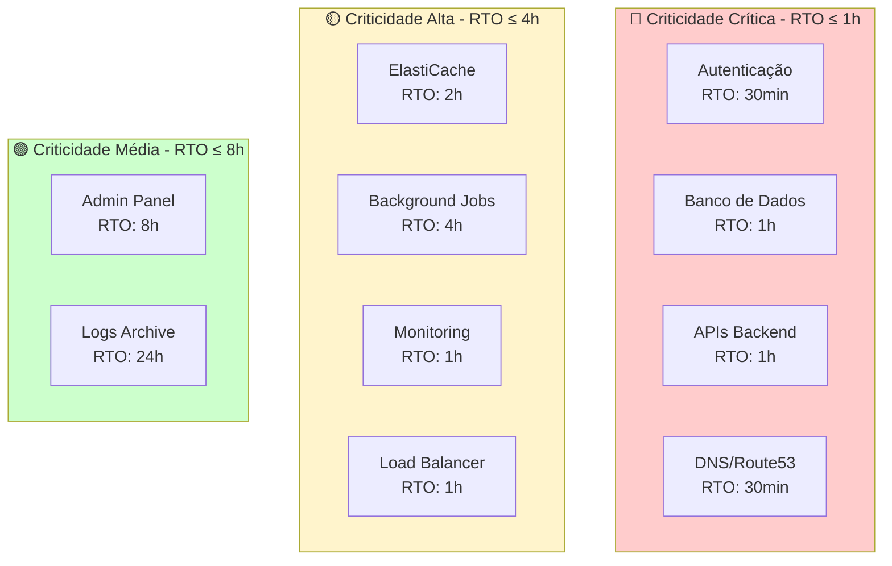
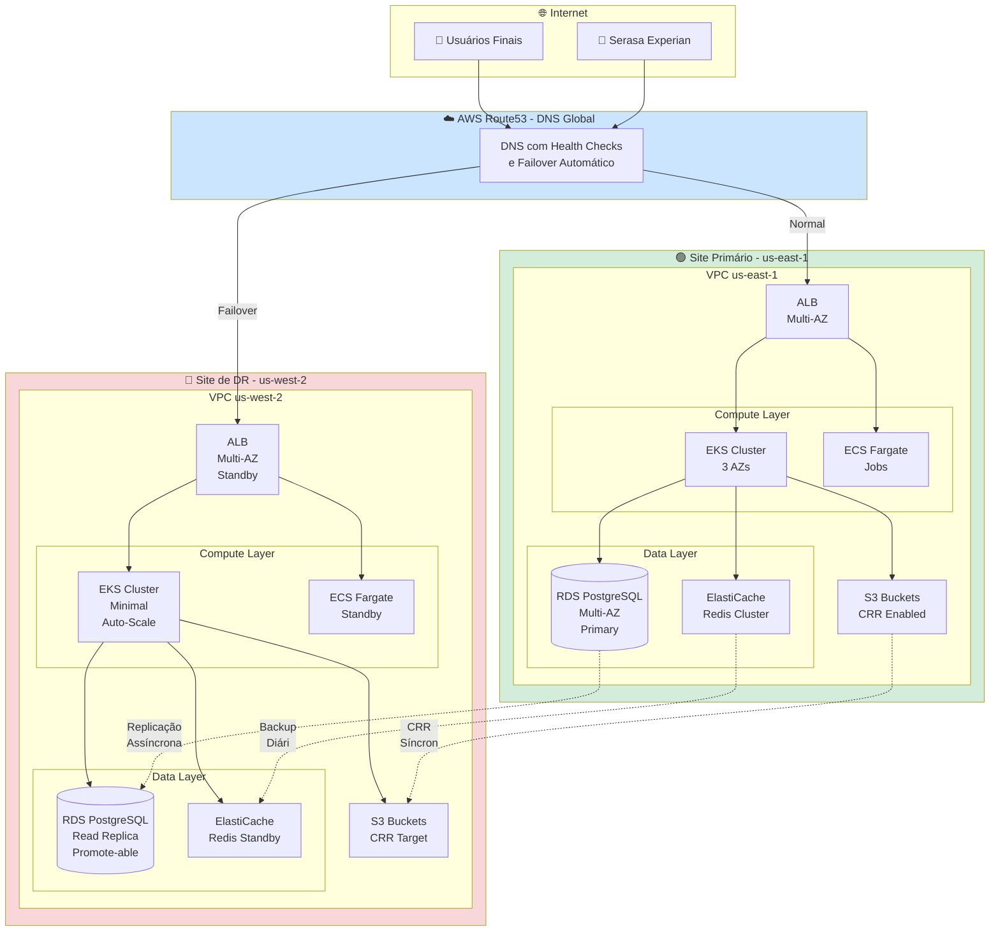
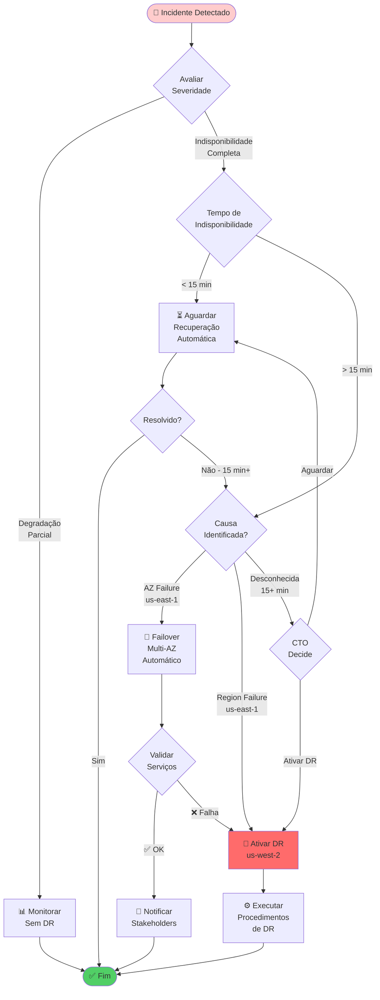
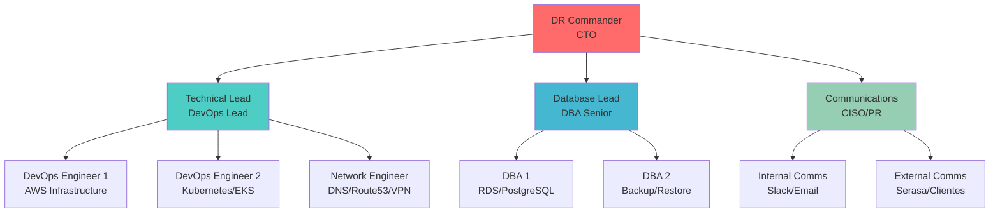

# Plano de Recuperação de Desastres (PRD/DRP)

## 📋 Controle de Versão

| Versão | Data | Autor | Descrição | Aprovador |
|--------|------|-------|-----------|-----------|
| 1.0 | [DATA] | [NOME - DevOps Lead] | Versão inicial do PRD | [NOME - CTO] |
| 1.1 | [DATA] | [NOME - DevOps Lead] | [DESCRIÇÃO DAS MUDANÇAS] | [NOME - CTO] |

---

## 📄 Sumário Executivo

Este Plano de Recuperação de Desastres (PRD) define os procedimentos técnicos, recursos e responsabilidades necessários para restaurar a infraestrutura tecnológica de **[NOME DA EMPRESA]** em caso de desastres que causem indisponibilidade total ou parcial dos sistemas críticos.

O PRD está alinhado com o **[Plano de Continuidade de Negócios (BCP)](01-plano-continuidade-negocios.md)** e garante o cumprimento dos seguintes objetivos:

| Métrica | Valor Contratual | Valor Testado | Status |
|---------|------------------|---------------|--------|
| **RTO (Recovery Time Objective)** | ≤ 2 horas | [X.X] horas | ✅ Conforme |
| **RPO (Recovery Point Objective)** | ≤ 15 minutos | [X] minutos | ✅ Conforme |
| **Disponibilidade Anual** | ≥ 99.9% | [XX.XX]% | ✅ Conforme |

**Última Atualização:** [DATA]  
**Próximo Teste Completo:** [DATA]  
**Conformidade:** ISO 22301:2019, ISO 27001:2022, SOC 2 (Availability)

---

## 🎯 1. Escopo Tecnológico

### 1.1 Infraestrutura Crítica

Este PRD cobre os seguintes componentes de infraestrutura:

#### 1.1.1 Servidores e Compute

| Componente | Tecnologia | Localização Primária | Localização DR | Criticidade |
|------------|-----------|---------------------|---------------|-------------|
| **API Backend** | AWS EKS (Kubernetes) | us-east-1 | us-west-2 | Crítica |
| **Banco de Dados Transacional** | AWS RDS PostgreSQL 14 | us-east-1 (Multi-AZ) | us-west-2 (Read Replica) | Crítica |
| **Cache / Session Store** | AWS ElastiCache Redis | us-east-1 | us-west-2 | Alta |
| **Autenticação / OAuth** | AWS EC2 (Keycloak) | us-east-1 | us-west-2 | Crítica |
| **Background Jobs** | AWS ECS (Fargate) | us-east-1 | us-west-2 | Alta |
| **Admin Panel** | AWS S3 + CloudFront | us-east-1 | us-west-2 (replicado) | Média |

#### 1.1.2 Redes e Conectividade

| Componente | Tecnologia | Redundância | Criticidade |
|------------|-----------|-------------|-------------|
| **Load Balancer** | AWS ALB (Application Load Balancer) | Multi-AZ | Crítica |
| **DNS** | AWS Route53 (Geo-routing + Health Checks) | Global | Crítica |
| **VPN** | AWS VPN + Transit Gateway | Multi-AZ | Alta |
| **CDN** | AWS CloudFront | Global (Edge Locations) | Alta |
| **WAF** | AWS WAF | Global | Alta |

#### 1.1.3 Armazenamento e Dados

| Componente | Tecnologia | Replicação | RPO | Criticidade |
|------------|-----------|-----------|-----|-------------|
| **Object Storage** | AWS S3 (Standard) | Cross-Region Replication | 0 (versionamento) | Crítica |
| **Backups RDS** | AWS Backup | Cross-Region (us-west-2) | 15 minutos | Crítica |
| **Logs de Aplicação** | AWS CloudWatch Logs | us-east-1 | Alta |
| **Logs de Auditoria** | AWS S3 (Glacier) | Cross-Region | Média |

### 1.2 Dependências Tecnológicas do Contrato Serasa

**Serviços específicos fornecidos à Serasa Experian:**

1. **API de Consulta de Crédito** (`/api/v1/credit-check`)
   - RTO: 1 hora
   - RPO: 15 minutos
   - Tráfego médio: 1.000 req/min

2. **API de Validação de Documentos** (`/api/v1/document-validation`)
   - RTO: 2 horas
   - RPO: 15 minutos
   - Tráfego médio: 500 req/min

3. **Webhook de Notificações** (`/webhooks/serasa/notifications`)
   - RTO: 4 horas
   - RPO: 30 minutos
   - Tráfego médio: 100 req/min

**Dependências Externas:**
- AWS Cloud (provedor de infraestrutura primário)
- [ISP Principal] (conectividade fibra)
- [ISP Backup] (conectividade 4G/5G failover)
- [Outros Fornecedores Críticos - ex: GitHub, etc.]

**Nota:** Serasa Experian é um **CLIENTE** que consome nossas APIs, não uma dependência externa.

---

## 📊 2. Objetivos de Recuperação

### 2.1 RTO (Recovery Time Objective) por Sistema

Tempo máximo tolerável para restaurar cada sistema após um desastre:

| Sistema / Aplicação | RTO Contratual | RTO Alcançado (Último Teste) | Prioridade de Recuperação |
|---------------------|----------------|------------------------------|--------------------------|
| **1. Autenticação (Keycloak)** | 30 min | [XX] min | 🔴 P1 - Crítica |
| **2. Banco de Dados (RDS)** | 1 hora | [XX] min | 🔴 P1 - Crítica |
| **3. APIs Backend (EKS)** | 1 hora | [XX] min | 🔴 P1 - Crítica |
| **4. Cache (ElastiCache)** | 2 horas | [XX] min | 🟡 P2 - Alta |
| **5. Background Jobs (ECS)** | 4 horas | [X] horas | 🟡 P2 - Alta |
| **6. Admin Panel (S3+CF)** | 8 horas | [X] horas | 🟢 P3 - Média |
| **7. Monitoring (CloudWatch)** | 1 hora | [XX] min | 🟡 P2 - Alta |

**Ordem de Restauração:** P1 → P2 → P3

### 2.2 RPO (Recovery Point Objective) por Aplicação

Perda máxima de dados aceitável:

| Tipo de Dado | RPO Contratual | Estratégia de Backup | Frequência | Última Validação |
|--------------|----------------|---------------------|-----------|------------------|
| **Transações Financeiras** | 5 min | RDS Automated Backup + WAL | Contínuo | [DATA] |
| **Dados de Clientes (PII)** | 15 min | RDS Automated Backup | A cada 15 min | [DATA] |
| **Sessões de Usuário** | 30 min | Redis AOF (Append-Only File) | A cada 1 min | [DATA] |
| **Arquivos Uploadados** | 0 (zero) | S3 Versioning + CRR | Síncrono | [DATA] |
| **Logs de Aplicação** | 1 hora | CloudWatch + S3 export | A cada 1 hora | [DATA] |
| **Configurações (AWS Config)** | N/A | AWS Config Snapshots | Contínuo | [DATA] |

**Referência:** Ver [Política de Backup e Restauração](06-politica-backup-restauracao.md) para detalhes completos.

### 2.3 Matriz de Criticidade de Sistemas



---

## 🏗️ 3. Arquitetura de Recuperação

### 3.1 Topologia Geral: Site Primário vs. Site de DR



### 3.2 Estratégias de Replicação de Dados

#### 3.2.1 Banco de Dados (RDS PostgreSQL)

**Primário (us-east-1):**
- RDS Multi-AZ (failover automático entre AZs)
- Automated backups a cada 15 minutos
- Transaction logs (WAL) replicados para standby

**Secundário (us-west-2):**
- Read Replica cross-region (replicação assíncrona)
- Lag típico: < 5 segundos
- Pode ser promovida a master independente

**Processo de Failover:**
1. Multi-AZ failover automático (dentro de us-east-1) - RTO: 1-2 min
2. Se região inteira falhar → promover Read Replica em us-west-2 - RTO: 30-60 min

#### 3.2.2 Object Storage (S3)

**Estratégia:** Cross-Region Replication (CRR)

```
Bucket Primary (us-east-1)
    ├── /prod-data/
    │   └── Replicado para: us-west-2 (≤ 15 min, 99.99% SLA)
    ├── /prod-uploads/
    │   └── Replicado para: us-west-2 (≤ 15 min)
    └── /prod-backups/
        └── Replicado para: us-west-2 (≤ 1 hora)
```

**Versionamento:** Habilitado em ambas as regiões (RPO = 0)

#### 3.2.3 Cache (ElastiCache Redis)

**Estratégia:** Backup diário + Replicação manual em caso de DR

**Primário:**
- Redis Cluster Mode Enabled (3 shards x 2 replicas)
- AOF (Append-Only File) habilitado
- Backup automático diário (snapshot)

**Secundário (Cold Standby):**
- Cluster provisionado mas com mínimo de nodes
- Restaurado de snapshot em caso de failover
- RTO: 2 horas | RPO: 24 horas (último snapshot)

**Aceitação de Perda:** Dados de cache/sessão podem ser reconstruídos

---

## 🔧 4. Procedimentos de Recuperação

### 4.1 Procedimento Geral de DR

#### Fluxo de Decisão: Quando Ativar DR?



### 4.2 Passo a Passo Técnico: Failover para DR Site (us-west-2)

#### Fase 1: Preparação e Validação (0-15 minutos)

**Responsável:** DevOps On-Call → DevOps Lead → CTO

**Checklist:**

- [ ] **[DevOps On-Call]** Confirmar indisponibilidade total de us-east-1
  ```bash
  # Validar status via AWS CLI
  aws ec2 describe-instance-status --region us-east-1 --query 'InstanceStatuses[*].[InstanceId,InstanceState.Name,InstanceStatus.Status]'
  
  # Validar via dashboard
  open https://console.aws.amazon.com/ec2/v2/home?region=us-east-1
  ```

- [ ] **[DevOps On-Call]** Verificar AWS Service Health Dashboard
  ```
  URL: https://health.aws.amazon.com/health/status
  Região: us-east-1
  ```

- [ ] **[DevOps On-Call]** Notificar CTO/CISO via CloudWatch Alarm + Slack + Celular
  ```
  Template: "CRITICAL: us-east-1 completamente down. 
  Ativação de DR requerida. Aguardando aprovação."
  ```

- [ ] **[CTO]** Aprovar ativação de DR (verbal + Slack #incidents)
  ```
  Comando Slack: /incident declare "DR Activation - us-east-1 failure"
  ```

- [ ] **[DevOps Lead]** Convocar Equipe de DR (via Slack + Telefone)
  ```
  Papéis necessários:
  - 2x DevOps Engineers
  - 1x DBA
  - 1x Network Engineer
  - 1x Security Engineer (se ataque cibernético)
  ```

- [ ] **[DevOps Lead]** Abrir Google Meet War Room
  ```
  URL permanente: https://meet.google.com/[MEETING-CODE]
  ```

**Tempo Total Fase 1:** 10-15 minutos

---

#### Fase 2: Failover de Banco de Dados (15-45 minutos)

**Responsável:** DBA Lead + DevOps Engineer

**Sub-etapa 2.1: Promover Read Replica a Master (15-30 min)**

- [ ] **[DBA]** Verificar lag de replicação
  ```sql
  -- Executar em Read Replica (us-west-2)
  SELECT 
      pg_last_wal_receive_lsn(),
      pg_last_wal_replay_lsn(),
      EXTRACT(EPOCH FROM (now() - pg_last_xact_replay_timestamp())) AS lag_seconds;
  ```
  **Aceitável:** lag < 30 segundos

- [ ] **[DBA]** Promover Read Replica via AWS Console
  ```bash
  aws rds promote-read-replica \
      --db-instance-identifier prod-db-us-west-2-replica \
      --region us-west-2 \
      --backup-retention-period 7 \
      --preferred-backup-window "03:00-04:00" \
      --no-apply-immediately  # Executar imediatamente
  ```
  **Duração:** 5-10 minutos

- [ ] **[DBA]** Aguardar promoção completar
  ```bash
  # Monitorar status
  aws rds describe-db-instances \
      --db-instance-identifier prod-db-us-west-2-replica \
      --region us-west-2 \
      --query 'DBInstances[0].DBInstanceStatus'
  
  # Status esperado: "available"
  ```

**Sub-etapa 2.2: Validar Integridade de Dados (5-10 min)**

- [ ] **[DBA]** Conectar ao novo master e validar
  ```sql
  -- Conectar: psql -h prod-db-us-west-2.xxxx.rds.amazonaws.com -U admin -d proddb
  
  -- Validar contagem de registros críticos
  SELECT 'users' AS table_name, COUNT(*) FROM users
  UNION ALL
  SELECT 'transactions', COUNT(*) FROM transactions
  UNION ALL
  SELECT 'sessions', COUNT(*) FROM sessions;
  
  -- Verificar última transação
  SELECT MAX(created_at) FROM transactions;
  ```
  **Ação:** Comparar com último snapshot conhecido

- [ ] **[DBA]** Habilitar backups automáticos
  ```bash
  aws rds modify-db-instance \
      --db-instance-identifier prod-db-us-west-2-replica \
      --backup-retention-period 30 \
      --apply-immediately \
      --region us-west-2
  ```

- [ ] **[DBA]** Documentar RPO alcançado
  ```
  RPO Contratual: 15 minutos
  RPO Alcançado: [X] minutos (baseado em última transação)
  Status: [CONFORME / NÃO CONFORME]
  ```

**Tempo Total Fase 2:** 25-40 minutos

---

#### Fase 3: Failover de Aplicações (30-60 minutos)

**Responsável:** DevOps Team

**Sub-etapa 3.1: Escalar EKS Cluster em us-west-2 (10-15 min)**

- [ ] **[DevOps]** Escalar node groups do EKS
  ```bash
  # Escalar de 2 nodes (standby) para 10 nodes (produção)
  aws eks update-nodegroup-config \
      --cluster-name prod-eks-us-west-2 \
      --nodegroup-name prod-ng-us-west-2 \
      --scaling-config minSize=10,maxSize=20,desiredSize=10 \
      --region us-west-2
  ```

- [ ] **[DevOps]** Aguardar nodes ficarem Ready
  ```bash
  kubectl get nodes --context=west-cluster -w
  
  # Aguardar até todos nodes mostrarem "Ready"
  ```

**Sub-etapa 3.2: Atualizar ConfigMaps com novo DB endpoint (5 min)**

- [ ] **[DevOps]** Atualizar ConfigMap com endpoint do novo master DB
  ```bash
  kubectl edit configmap app-config --context=west-cluster -n production
  
  # Alterar:
  # DB_HOST: prod-db-us-east-1.xxxx.rds.amazonaws.com
  # Para:
  # DB_HOST: prod-db-us-west-2.yyyy.rds.amazonaws.com
  ```

- [ ] **[DevOps]** Reiniciar deployments para pegar novo config
  ```bash
  kubectl rollout restart deployment/api-backend --context=west-cluster -n production
  kubectl rollout restart deployment/auth-service --context=west-cluster -n production
  kubectl rollout restart deployment/worker-jobs --context=west-cluster -n production
  ```

**Sub-etapa 3.3: Validar Health Checks (10-15 min)**

- [ ] **[DevOps]** Aguardar todos pods ficarem Running
  ```bash
  kubectl get pods --context=west-cluster -n production -w
  
  # Aguardar status: Running (X/X containers ready)
  ```

- [ ] **[DevOps]** Executar smoke tests
  ```bash
  # Health check geral
  curl -I https://api-west.[dominio].com/health
  # Esperado: HTTP/2 200
  
  # Smoke test autenticação
  ./tests/smoke/auth_smoke_test.sh us-west-2
  
  # Smoke test APIs críticas
  ./tests/smoke/api_smoke_test.sh us-west-2
  ```

- [ ] **[QA/DevOps]** Validar fluxo end-to-end
  ```
  Testar manualmente:
  1. Login de usuário
  2. Consulta de dados (Serasa endpoint)
  3. Transação simples
  4. Upload de arquivo
  ```

**Tempo Total Fase 3:** 30-45 minutos

---

#### Fase 4: Failover de DNS (45-60 minutos)

**Responsável:** DevOps Engineer + Network Engineer

- [ ] **[DevOps]** Atualizar Route53 para apontar para us-west-2
  ```bash
  # Opção 1: Automático (Health Check falha)
  # Route53 detecta falha em us-east-1 e redireciona automaticamente
  # TTL: 60 segundos → propagação em ~5 minutos
  
  # Opção 2: Manual (se automático falhar)
  aws route53 change-resource-record-sets \
      --hosted-zone-id Z1234567ABCD \
      --change-batch file://dns-failover-west.json
  ```

**Arquivo:** `dns-failover-west.json`
```json
{
  "Changes": [{
    "Action": "UPSERT",
    "ResourceRecordSet": {
      "Name": "api.[dominio].com",
      "Type": "CNAME",
      "TTL": 60,
      "ResourceRecords": [{
        "Value": "prod-alb-us-west-2-xxxx.elb.amazonaws.com"
      }]
    }
  }]
}
```

- [ ] **[DevOps]** Verificar propagação de DNS
  ```bash
  # Verificar em múltiplos servidores DNS
  dig @8.8.8.8 api.[dominio].com
  dig @1.1.1.1 api.[dominio].com
  dig @resolver1.opendns.com api.[dominio].com
  
  # Todos devem apontar para ALB us-west-2
  ```

- [ ] **[DevOps]** Aguardar TTL expirar (60 segundos)
  ```bash
  # Testar de múltiplas localizações
  curl -I https://api.[dominio].com/health
  ```

**Tempo Total Fase 4:** 5-15 minutos (+ tempo de propagação DNS)

---

#### Fase 5: Validação Final e Monitoramento (60-120 minutos)

**Responsável:** DevOps Lead + CTO

- [ ] **[DevOps]** Monitorar dashboards de produção
  ```
  Métricas críticas:
  - Request Rate (deve retornar ao normal em 10-15 min)
  - Error Rate (deve estar < 1%)
  - Latência P95 (deve estar < 500ms)
  - Database Connections (deve estabilizar)
  ```

- [ ] **[DevOps]** Validar tráfego de Serasa Experian especificamente
  ```bash
  # Filtrar logs de Serasa
  kubectl logs -f deployment/api-backend --context=west-cluster -n production | grep "serasa"
  
  # Verificar taxa de sucesso
  # Esperado: > 99% success rate
  ```

- [ ] **[Suporte]** Monitorar volume de tickets/chamados
  ```
  Zendesk Dashboard: Comparar com baseline normal
  Esperado: Pico nos primeiros 30 min, depois normalizar
  ```

- [ ] **[DevOps Lead]** Declarar RTO alcançado
  ```
  Timestamp Início Incidente: [HH:MM]
  Timestamp Serviços Restaurados: [HH:MM]
  RTO Alcançado: [XX] minutos
  RTO Contratual: 120 minutos
  Status: [CONFORME / NÃO CONFORME]
  ```

- [ ] **[CTO]** Aprovar declaração de "Serviços Restaurados"
  ```
  Slack #incidents: "@here DR concluído. Serviços operando em us-west-2."
  ```

**Tempo Total Fase 5:** Monitoramento contínuo (primeiras 24-48 horas críticas)

---

### 4.3 Scripts de Automação

#### Script 1: `dr-failover-complete.sh`

```bash
#!/bin/bash
############################################################
# DR Failover Completo: us-east-1 → us-west-2
# Autor: [NOME - DevOps Lead]
# Última Atualização: [DATA]
# Uso: ./dr-failover-complete.sh [--auto-approve]
############################################################

set -euo pipefail

# Cores para output
RED='\033[0;31m'
GREEN='\033[0;32m'
YELLOW='\033[1;33m'
NC='\033[0m' # No Color

# Configurações
AWS_REGION_DR="us-west-2"
EKS_CLUSTER_DR="prod-eks-us-west-2"
RDS_REPLICA_ID="prod-db-us-west-2-replica"
ROUTE53_HOSTED_ZONE="Z1234567ABCD"

echo -e "${RED}========================================${NC}"
echo -e "${RED}  ⚠️  DR FAILOVER PARA US-WEST-2  ⚠️${NC}"
echo -e "${RED}========================================${NC}"
echo ""

# Confirmação (se não --auto-approve)
if [[ "${1:-}" != "--auto-approve" ]]; then
    echo -e "${YELLOW}Esta operação irá:${NC}"
    echo "  1. Promover RDS Read Replica a Master"
    echo "  2. Escalar EKS cluster em us-west-2"
    echo "  3. Atualizar DNS para us-west-2"
    echo ""
    read -p "Você confirma a ativação do DR? (digite 'CONFIRMO'): " confirm
    
    if [[ "$confirm" != "CONFIRMO" ]]; then
        echo -e "${RED}❌ Operação cancelada.${NC}"
        exit 1
    fi
fi

echo ""
echo -e "${GREEN}✅ Iniciando DR Failover...${NC}"
echo ""

# Etapa 1: Promover RDS Replica
echo -e "${YELLOW}[Etapa 1/5] Promovendo RDS Read Replica...${NC}"
aws rds promote-read-replica \
    --db-instance-identifier "$RDS_REPLICA_ID" \
    --region "$AWS_REGION_DR" \
    --backup-retention-period 7 \
    --no-apply-immediately

echo "  Aguardando promoção completar (pode levar 5-10 min)..."
aws rds wait db-instance-available \
    --db-instance-identifier "$RDS_REPLICA_ID" \
    --region "$AWS_REGION_DR"

echo -e "${GREEN}  ✅ RDS promovido com sucesso.${NC}"
echo ""

# Etapa 2: Escalar EKS
echo -e "${YELLOW}[Etapa 2/5] Escalando EKS Cluster...${NC}"
aws eks update-nodegroup-config \
    --cluster-name "$EKS_CLUSTER_DR" \
    --nodegroup-name "prod-ng-us-west-2" \
    --scaling-config minSize=10,maxSize=20,desiredSize=10 \
    --region "$AWS_REGION_DR"

echo "  Aguardando nodes ficarem Ready..."
sleep 60  # Aguardar provisionamento

kubectl get nodes --context=west-cluster
echo -e "${GREEN}  ✅ EKS escalado com sucesso.${NC}"
echo ""

# Etapa 3: Atualizar ConfigMaps
echo -e "${YELLOW}[Etapa 3/5] Atualizando ConfigMaps...${NC}"

NEW_DB_HOST=$(aws rds describe-db-instances \
    --db-instance-identifier "$RDS_REPLICA_ID" \
    --region "$AWS_REGION_DR" \
    --query 'DBInstances[0].Endpoint.Address' \
    --output text)

kubectl patch configmap app-config \
    --context=west-cluster \
    -n production \
    -p "{\"data\":{\"DB_HOST\":\"$NEW_DB_HOST\"}}"

echo -e "${GREEN}  ✅ ConfigMaps atualizados.${NC}"
echo ""

# Etapa 4: Reiniciar Deployments
echo -e "${YELLOW}[Etapa 4/5] Reiniciando Deployments...${NC}"
kubectl rollout restart deployment/api-backend --context=west-cluster -n production
kubectl rollout restart deployment/auth-service --context=west-cluster -n production
kubectl rollout restart deployment/worker-jobs --context=west-cluster -n production

echo "  Aguardando rollout completar..."
kubectl rollout status deployment/api-backend --context=west-cluster -n production --timeout=5m
kubectl rollout status deployment/auth-service --context=west-cluster -n production --timeout=5m

echo -e "${GREEN}  ✅ Deployments reiniciados.${NC}"
echo ""

# Etapa 5: Atualizar DNS
echo -e "${YELLOW}[Etapa 5/5] Atualizando DNS (Route53)...${NC}"

ALB_DR=$(kubectl get svc api-backend --context=west-cluster -n production -o jsonpath='{.status.loadBalancer.ingress[0].hostname}')

cat > /tmp/dns-change.json <<EOF
{
  "Changes": [{
    "Action": "UPSERT",
    "ResourceRecordSet": {
      "Name": "api.[dominio].com",
      "Type": "CNAME",
      "TTL": 60,
      "ResourceRecords": [{"Value": "$ALB_DR"}]
    }
  }]
}
EOF

aws route53 change-resource-record-sets \
    --hosted-zone-id "$ROUTE53_HOSTED_ZONE" \
    --change-batch file:///tmp/dns-change.json

echo -e "${GREEN}  ✅ DNS atualizado (propagação em ~5 min).${NC}"
echo ""

# Resumo
echo -e "${GREEN}========================================${NC}"
echo -e "${GREEN}  ✅ DR FAILOVER CONCLUÍDO COM SUCESSO${NC}"
echo -e "${GREEN}========================================${NC}"
echo ""
echo "Próximos passos:"
echo "  1. Validar smoke tests: ./tests/smoke/run_all.sh us-west-2"
echo "  2. Monitorar dashboards: CloudWatch Console"
echo "  3. Notificar Serasa Experian: Ver template em seção 7.1 do BCP"
echo ""
echo -e "${YELLOW}⚠️  Lembre-se: Este é o site de DR. Planejar failback após us-east-1 normalizar.${NC}"
```

**Localização:** `/opt/scripts/dr-failover-complete.sh`  
**Permissões:** `chmod +x` (apenas DevOps team)

---

## 👥 5. Equipe Técnica e Responsabilidades

### 5.1 Organograma de Resposta a Desastres



### 5.2 Matriz de Escalação 24/7

| Nível | Papel | Nome | Contato Primário | Contato Backup | Horário |
|-------|-------|------|------------------|----------------|---------|
| **L1** | DevOps On-Call | [NOME 1] | [CELULAR 1] | [CELULAR 2] | 24/7 (rotativo semanal) |
| **L1** | DevOps On-Call | [NOME 2] | [CELULAR 2] | [CELULAR 1] | 24/7 (rotativo semanal) |
| **L2** | DevOps Lead | [NOME] | [CELULAR] | [EMAIL] | 24/7 (permanente) |
| **L2** | DBA Senior | [NOME] | [CELULAR] | [EMAIL] | 24/7 (permanente) |
| **L3** | CTO | [NOME] | [CELULAR] | [EMAIL] | 24/7 (emergências) |
| **L3** | CISO | [NOME] | [CELULAR] | [EMAIL] | 24/7 (emergências) |

**Política de Escalação:**
- **L1 → L2:** Após 15 minutos sem resolução
- **L2 → L3:** Após 30 minutos ou se decisão executiva necessária
- **L3 ativa DR:** CTO tem autoridade final para ativar failover

**Ferramenta de On-Call:** CloudWatch Alarms + Slack (escalação via telefone)

---

## 🧪 6. Testes de Recuperação

### 6.1 Metodologia de Testes

#### 6.1.1 Teste Tabletop (Trimestral)

**Objetivo:** Validar conhecimento da equipe sobre procedimentos de DR

**Duração:** 2-3 horas

**Metodologia:**
1. Apresentar cenário: "us-east-1 completamente indisponível"
2. Equipe discute procedimentos sem executar
3. Identificar gaps de documentação ou conhecimento

**Próximo Teste:** [DATA]

**Critérios de Sucesso:**
- [ ] 100% da equipe de DR participou
- [ ] Todos os passos críticos foram mencionados
- [ ] Tempo estimado < RTO contratual (2 horas)

#### 6.1.2 Teste de DR Simulado (Semestral)

**Objetivo:** Executar failover técnico em ambiente de staging

**Duração:** 4-6 horas

**Metodologia:**
1. Executar failover completo em staging
2. Validar funcionamento de todos os serviços
3. Medir RTO e RPO alcançados
4. Executar failback

**Próximo Teste:** [DATA]

**Critérios de Sucesso:**
- [ ] Failover concluído em < 2 horas
- [ ] RPO < 15 minutos
- [ ] 100% dos smoke tests passaram
- [ ] Failback executado com sucesso

#### 6.1.3 Teste de DR Completo (Anual)

**Objetivo:** Failover REAL em ambiente de produção

**Duração:** 4-8 horas (inclui failback)

**Metodologia:**
1. Comunicar clientes com 1 semana de antecedência
2. Janela de manutenção (madrugada de sábado/domingo)
3. Executar failover us-east-1 → us-west-2
4. Operar em us-west-2 por 24-48 horas
5. Executar failback para us-east-1

**Próximo Teste:** [DATA]

**Critérios de Sucesso:**
- [ ] RTO contratual cumprido (< 2 horas)
- [ ] RPO contratual cumprido (< 15 minutos)
- [ ] SLA de disponibilidade mantido (99.9%)
- [ ] Zero incidentes críticos durante teste
- [ ] Serasa Experian validou funcionalidade

### 6.2 Cronograma Anual de Testes

| Mês | Tipo de Teste | Status | Data Planejada | Data Executada | Resultado |
|-----|---------------|--------|----------------|----------------|-----------|
| Jan | Tabletop | ✅ Completo | 15/01/[ANO] | 15/01/[ANO] | ✅ Aprovado |
| Abr | Tabletop | ⏸️ Planejado | 15/04/[ANO] | - | - |
| Jun | **DR Simulado (Staging)** | ⏸️ Planejado | 30/06/[ANO] | - | - |
| Jul | Tabletop | ⏸️ Planejado | 15/07/[ANO] | - | - |
| Out | Tabletop | ⏸️ Planejado | 15/10/[ANO] | - | - |
| Dez | **DR Completo (Produção)** | ⏸️ Planejado | 07/12/[ANO] | - | - |

### 6.3 Métricas de Sucesso dos Testes

| Métrica | Target | Último Teste | Status |
|---------|--------|--------------|--------|
| **RTO Alcançado** | ≤ 2 horas | [X.X] horas | ✅ / ❌ |
| **RPO Alcançado** | ≤ 15 minutos | [X] minutos | ✅ / ❌ |
| **Taxa de Sucesso (Smoke Tests)** | 100% | [XX]% | ✅ / ❌ |
| **Downtime Total** | ≤ 2 horas | [X.X] horas | ✅ / ❌ |
| **Participação da Equipe** | 100% | [XX]% | ✅ / ❌ |

---

## 7. Integração com Backup e Restore

**Referência Completa:** Ver **[06-politica-backup-restauracao.md](06-politica-backup-restauracao.md)**

### 7.1 Resumo de Políticas de Backup

| Tipo de Backup | Frequência | Retenção | Localização | RPO |
|----------------|-----------|----------|-------------|-----|
| **RDS Automated Backup** | A cada 15 min | 30 dias | us-east-1 + us-west-2 | 15 min |
| **RDS Manual Snapshot** | Semanal (domingos) | 90 dias | us-east-1 + us-west-2 | 7 dias |
| **S3 Versioning** | Contínuo | 365 dias | us-east-1 + us-west-2 | 0 (zero) |
| **Redis AOF** | Contínuo | 7 dias | us-east-1 | 30 min |
| **Redis Snapshot** | Diário | 30 dias | us-east-1 + us-west-2 | 24 horas |

### 7.2 Pontos de Verificação de Integridade

**Antes de Failover:**
- [ ] Último backup RDS foi executado com sucesso? (Verificar CloudWatch)
- [ ] Lag de replicação < 30 segundos? (Verificar métricas RDS)
- [ ] S3 CRR está atualizado? (Verificar métricas S3)

**Durante Failover:**
- [ ] Read Replica promovida sem erros?
- [ ] Integridade de dados validada? (contagem de registros)

**Pós-Failover:**
- [ ] Backups automáticos habilitados no novo master?
- [ ] Replicação para nova read replica configurada?

---

## ✅ Checklist de Validação do PRD

- [ ] Todas as seções obrigatórias estão preenchidas
- [ ] Placeholders substituídos por informações reais
- [ ] RTOs e RPOs testados e documentados
- [ ] Scripts de automação validados em staging
- [ ] Matriz de escalação 24/7 atualizada
- [ ] Diagramas Mermaid renderizando corretamente
- [ ] Procedimentos de failover testados (no mínimo tabletop)
- [ ] Integração com BCP validada (referências cruzadas corretas)
- [ ] Serasa Experian foi informada sobre este PRD
- [ ] Cronograma de testes anuais aprovado
- [ ] Documento aprovado pelo CTO (ver seção abaixo)

---

## ✍️ Aprovação

| Papel | Nome | Assinatura | Data |
|-------|------|------------|------|
| **Elaborado por** | [NOME - DevOps Lead] | __________ | [DATA] |
| **Revisado por** | [NOME - CISO] | __________ | [DATA] |
| **Aprovado por** | [NOME - CTO] | __________ | [DATA] |

---

## 📚 Referências Cruzadas

- **[01-plano-continuidade-negocios.md](01-plano-continuidade-negocios.md)** - BCP (estratégias de continuidade)
- **[06-politica-backup-restauracao.md](06-politica-backup-restauracao.md)** - Políticas de backup detalhadas
- **[05-relatorio-testes-anuais.md](05-relatorio-testes-anuais.md)** - Template de relatório de testes

---

## 📖 Glossário

| Termo | Definição |
|-------|-----------|
| **DR (Disaster Recovery)** | Recuperação de Desastres |
| **RTO** | Recovery Time Objective (Tempo Objetivo de Recuperação) |
| **RPO** | Recovery Point Objective (Ponto Objetivo de Recuperação) |
| **Failover** | Transferência de serviços para site secundário |
| **Failback** | Retorno de serviços para site primário |
| **Multi-AZ** | Múltiplas Zonas de Disponibilidade (AWS) |
| **CRR** | Cross-Region Replication (Replicação entre Regiões) |
| **Read Replica** | Réplica de leitura de banco de dados |
| **WAL** | Write-Ahead Log (PostgreSQL) |
| **AOF** | Append-Only File (Redis) |
| **Health Check** | Verificação de saúde de serviços |

---

**🔒 Classificação:** CONFIDENCIAL - USO INTERNO  
**📁 Categoria:** Compliance - ISO 22301, ISO 27001  
**📅 Validade:** [DATA] até [DATA + 6 MESES]  
**🔄 Próxima Revisão:** [DATA + 6 MESES]  
**👤 Responsável:** [NOME - CTO/DevOps Lead]

---

**Versão do Template:** 1.0 - Genérico  
**Data de Criação:** 09/10/2025  
**Conformidade:** ISO 22301:2019, ISO 27001:2022, SOC 2 (Availability)  
**Para uso com:** Serasa Experian e demais clientes enterprise

