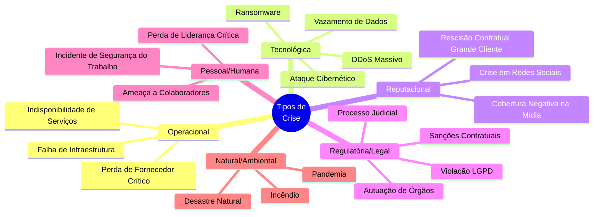
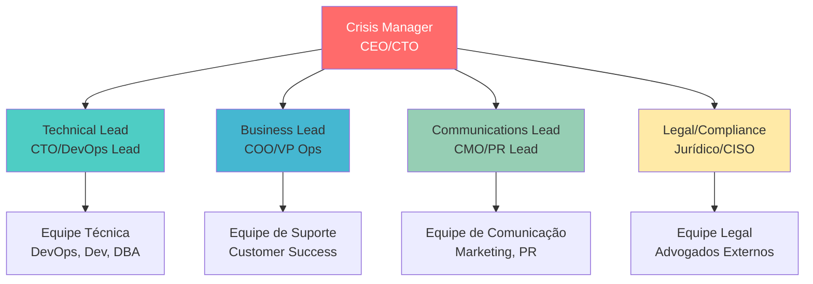
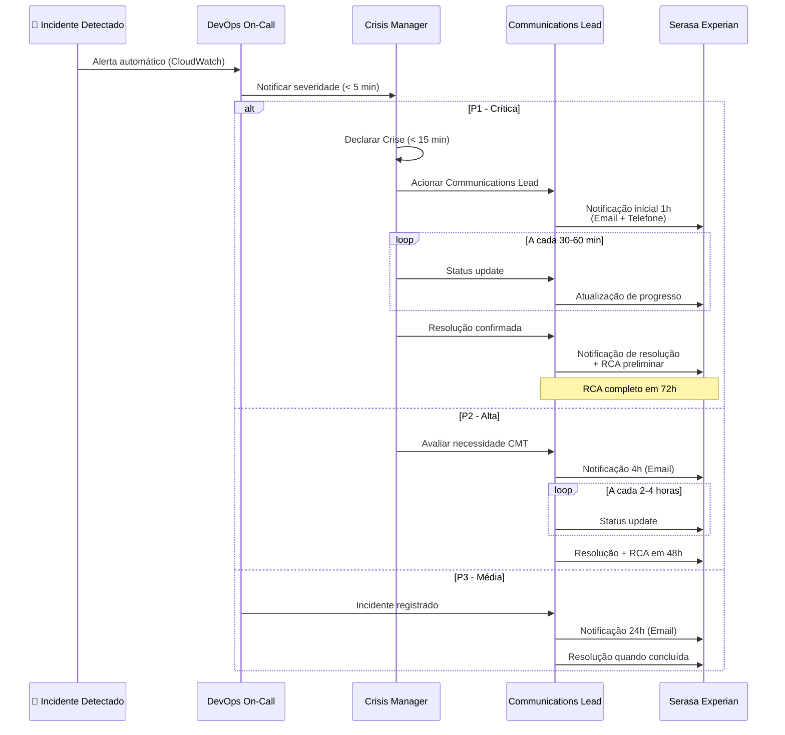

# Plano de Gerenciamento de Crise

## 📋 Controle de Versão

| Versão | Data | Autor | Descrição | Aprovador |
|--------|------|-------|-----------|-----------|
| 1.0 | [DATA] | [NOME - CISO/Crisis Manager] | Versão inicial do Plano de Crise | [NOME - CEO] |
| 1.1 | [DATA] | [NOME - CISO] | [DESCRIÇÃO DAS MUDANÇAS] | [NOME - CEO] |

---

## 📄 Sumário Executivo

Este Plano de Gerenciamento de Crise estabelece os procedimentos, estrutura de governança e canais de comunicação para responder a eventos críticos que possam impactar significativamente as operações, reputação ou continuidade de negócios de **[NOME DA EMPRESA]**.

O plano visa:
-  Proteger colaboradores, ativos e reputação da empresa
-  Minimizar impactos operacionais e financeiros
-  Garantir comunicação transparente e oportuna com stakeholders
-  Cumprir obrigações contratuais com clientes (incluindo Serasa Experian)
-  Preservar conformidade regulatória e legal

**Escopo:** Crises operacionais, tecnológicas, reputacionais, regulatórias e de segurança da informação.

**Integração:** Este plano integra-se com:
- **[01-plano-continuidade-negocios.md](01-plano-continuidade-negocios.md)** - BCP
- **[02-plano-recuperacao-desastres.md](02-plano-recuperacao-desastres.md)** - DRP

---

## 🎯 1. Definição e Tipos de Crise

### 1.1 O que Caracteriza uma Crise?

Uma **crise** é definida como qualquer evento não planejado que:
- Ameaça a segurança de pessoas ou ativos
- Causa interrupção significativa de serviços críticos
- Gera impacto financeiro > R$ [VALOR THRESHOLD]
- Expõe a empresa a riscos legais, regulatórios ou reputacionais
- Requer coordenação de múltiplas áreas/equipes
- Demanda comunicação externa urgente

### 1.2 Classificação de Severidade

| Nível | Severidade | Descrição | Exemplos | SLA de Notificação |
|-------|-----------|-----------|----------|-------------------|
| **🔴 P1** | **Crítica** | Impacto imediato e severo em operações críticas ou segurança | • Data center completamente down<br/>• Ransomware massivo<br/>• Vazamento de dados sensíveis | **1 hora** |
| **🟡 P2** | **Alta** | Impacto significativo mas não total em operações | • Degradação de performance severa<br/>• Incidente de segurança contido<br/>• Perda de fornecedor crítico | **4 horas** |
| **🟢 P3** | **Média** | Impacto moderado com workarounds disponíveis | • Falha de sistema não crítico<br/>• Atraso em entregas<br/>• Issue de compliance menor | **24 horas** |
| **⚪ P4** | **Baixa** | Impacto mínimo, não requer ativação de crise | • Bugs menores<br/>• Performance degradada isolada | **Não aplicável** |

### 1.3 Tipos de Crise



---

## 🏛️ 2. Estrutura de Governança de Crise

### 2.1 Comitê de Gestão de Crise (CMT - Crisis Management Team)

#### 2.1.1 Composição do CMT



#### 2.1.2 Papéis e Responsabilidades

| Papel | Responsável | Responsabilidades Principais | Contato 24/7 |
|-------|-------------|----------------------------|--------------|
| **Crisis Manager** | [NOME - CEO/CTO] | • Declarar ativação/desativação de crise<br/>• Tomar decisões finais<br/>• Aprovar comunicações externas<br/>• Representar a empresa | [CELULAR]<br/>[EMAIL] |
| **Technical Lead** | [NOME - CTO/DevOps Lead] | • Coordenar resposta técnica<br/>• Executar PRD/BCP se necessário<br/>• Avaliar impacto técnico<br/>• Propor soluções | [CELULAR]<br/>[EMAIL] |
| **Business Lead** | [NOME - COO/VP Ops] | • Avaliar impacto no negócio<br/>• Priorizar clientes/contratos<br/>• Coordenar equipe de suporte<br/>• Liaison com clientes-chave | [CELULAR]<br/>[EMAIL] |
| **Communications Lead** | [NOME - CMO/PR] | • Redigir comunicados<br/>• Gerenciar mídia e redes sociais<br/>• Coordenar comunicação interna<br/>• Atualizar status page | [CELULAR]<br/>[EMAIL] |
| **Legal/Compliance Lead** | [NOME - Jurídico/CISO] | • Avaliar riscos legais<br/>• Garantir conformidade (LGPD, etc.)<br/>• Liaison com órgãos reguladores<br/>• Documentar para fins legais | [CELULAR]<br/>[EMAIL] |

#### 2.1.3 Critérios de Ativação do CMT

O CMT deve ser ativado quando:

**Ativação Obrigatória (Automática):**
-  Crise **P1 (Crítica)** declarada
-  Indisponibilidade total de serviços > 30 minutos
-  Vazamento de dados pessoais confirmado
-  Ataque cibernético em andamento (ransomware, DDoS severo)
-  Rescisão/ameaça de rescisão por cliente de faturamento > [R$ VALOR]
-  Processo judicial ou autuação regulatória

**Ativação Opcional (Discricionária):**
- 🟡 Crise **P2 (Alta)** com potencial de escalação
- 🟡 Cobertura negativa na mídia de grande alcance
- 🟡 Falha de fornecedor crítico sem alternativa imediata

**Quem Pode Ativar:**
1. CEO / CTO (decisão final)
2. CISO / DevOps Lead (crises técnicas/segurança)
3. Qualquer C-level em situação de emergência

---

## 📞 3. Matriz de Comunicação com Serasa Experian

### 3.1 Contatos Serasa Experian

| Papel | Nome | Cargo | Email | Telefone | Horário |
|-------|------|-------|-------|----------|---------|
| **Contato Principal** | [NOME SERASA] | [CARGO - Account Manager] | [EMAIL] | [TELEFONE] | Comercial |
| **Contato Técnico** | [NOME SERASA] | [CARGO - Tech Lead] | [EMAIL] | [TELEFONE] | Comercial |
| **Contato Emergencial** | [NOME SERASA] | [CARGO - Gerente/Diretor] | [EMAIL] | [TELEFONE CELULAR] | 24/7 |
| **Contato Backup** | [NOME SERASA] | [CARGO] | [EMAIL] | [TELEFONE] | Comercial |

**Atualização:** Revisar trimestralmente (último update: [DATA])

### 3.2 Canais Oficiais de Comunicação

| Canal | Uso | SLA de Resposta | Disponibilidade |
|-------|-----|----------------|-----------------|
| **Email Corporativo** | Comunicações formais e não urgentes | 4 horas (comercial) | 24/7 |
| **Telefone (Contato Principal)** | Notificações urgentes durante expediente | 30 min (comercial) | Seg-Sex 9h-18h |
| **Telefone Emergencial (Celular)** | Crises P1 fora do expediente | 1 hora | 24/7 |
| **Portal de Cliente** | Status updates, tickets | 8 horas | 24/7 |
| **WhatsApp Business** (se aplicável) | Comunicações rápidas | 2 horas | Comercial |

### 3.3 SLAs de Resposta por Severidade

| Severidade | Prazo para Notificação | Canal Obrigatório | Template |
|-----------|------------------------|-------------------|----------|
| **P1 - Crítica** | **1 hora** | Email + Telefone Emergencial | Seção 3.5.1 |
| **P2 - Alta** | **4 horas** | Email + Telefone (comercial) | Seção 3.5.2 |
| **P3 - Média** | **24 horas** | Email | Seção 3.5.3 |
| **Manutenção Programada** | **72 horas** (antecedência) | Email + Portal | Seção 3.5.4 |

### 3.4 Fluxo de Comunicação com Serasa



### 3.5 Templates de Comunicação

#### 3.5.1 Template P1 - Crise Crítica

```
Para: [EMAIL PRINCIPAL SERASA], [EMAIL EMERGENCIAL SERASA]
CC: [EMAIL TÉCNICO SERASA], [CMT INTERNO]
Assunto: 🚨 CRÍTICO - Notificação de Crise P1 - [NOME DA EMPRESA] - [DATA/HORA]

Prezado(a) [NOME CONTATO SERASA],

Informamos que uma CRISE CRÍTICA (P1) foi declarada em [NOME DA EMPRESA]:

━━━━━━━━━━━━━━━━━━━━━━━━━━━━━━━━━━
🚨 INFORMAÇÕES DA CRISE
━━━━━━━━━━━━━━━━━━━━━━━━━━━━━━━━━━

🆔 ID da Crise: CRISIS-P1-[YYYYMMDD]-[NNN]
📅 Data/Hora Declaração: [DD/MM/YYYY HH:MM UTC-3]
🔴 Severidade: P1 - CRÍTICA
📊 Status Atual: [Ativada/Em Resolução]
👤 Crisis Manager: [NOME - CARGO]

━━━━━━━━━━━━━━━━━━━━━━━━━━━━━━━━━━
🎯 IMPACTO NOS SERVIÇOS SERASA
━━━━━━━━━━━━━━━━━━━━━━━━━━━━━━━━━━

Serviços Impactados:
  • [API SERVIÇO 1]: [INDISPONÍVEL/DEGRADADO] ([X]% de performance)
  • [API SERVIÇO 2]: [INDISPONÍVEL/DEGRADADO] ([X]% de performance)
  • [API SERVIÇO 3]: [OPERACIONAL] (sem impacto)

Impacto em SLAs:
  • Disponibilidade: [SIM/NÃO] - [Descrição do impacto]
  • RTO: [Dentro/Fora do SLA] - ETA de Resolução: [HH:MM]
  • RPO: [Estimativa de perda de dados, se aplicável]

Transações Afetadas (estimativa):
  • Total: [N] transações impactadas
  • Período: [HH:MM] até o momento
  • Erro Rate: [X]%

━━━━━━━━━━━━━━━━━━━━━━━━━━━━━━━━━━
🔍 CAUSA RAIZ (PRELIMINAR)
━━━━━━━━━━━━━━━━━━━━━━━━━━━━━━━━━━

Causa Identificada: [Descrição breve da causa, se conhecida]

[Se não identificada:]
Investigação em Andamento: A equipe técnica está ativamente investigando 
a causa raiz. Informações serão compartilhadas assim que disponíveis.

━━━━━━━━━━━━━━━━━━━━━━━━━━━━━━━━━━
🔧 AÇÕES EM ANDAMENTO
━━━━━━━━━━━━━━━━━━━━━━━━━━━━━━━━━━

1. ✅ Comitê de Gestão de Crise (CMT) ativado
2. 🔄 [Ação Técnica 1 - Status: Em Progresso]
3. 🔄 [Ação Técnica 2 - Status: Em Progresso]
4. ⏳ [Ação Técnica 3 - Status: Planejada]

Plano de Recuperação:
  • [Descrição do plano de ação - ex: "Failover para região secundária"]
  • ETA de Resolução: [DD/MM/YYYY HH:MM UTC-3]
  • Confiança: [Alta/Média/Baixa]

━━━━━━━━━━━━━━━━━━━━━━━━━━━━━━━━━━
📞 PONTOS DE CONTATO PARA ACOMPANHAMENTO
━━━━━━━━━━━━━━━━━━━━━━━━━━━━━━━━━━

Crisis Manager:
  Nome: [NOME - CARGO]
  Email: [EMAIL]
  Celular: [TELEFONE] (disponível 24/7)

Technical Lead:
  Nome: [NOME - CARGO]
  Email: [EMAIL]
  Celular: [TELEFONE]

Status Page:
  https://status.[dominio].com
  (Atualizações em tempo real)

War Room (Google Meet):
  https://meet.google.com/[MEETING-CODE]
  Senha: [SENHA]
  [Se Serasa quiser acompanhar ao vivo]

━━━━━━━━━━━━━━━━━━━━━━━━━━━━━━━━━━
📅 PRÓXIMAS ATUALIZAÇÕES
━━━━━━━━━━━━━━━━━━━━━━━━━━━━━━━━━━

Frequência de Updates: A cada 30 minutos até resolução
Próximo Update Agendado: [HH:MM UTC-3]

━━━━━━━━━━━━━━━━━━━━━━━━━━━━━━━━━━

Pedimos desculpas pelo transtorno e garantimos que toda a nossa equipe está 
dedicada à resolução imediata desta crise.

Estamos à disposição para qualquer esclarecimento.

Atenciosamente,

[NOME DO CRISIS MANAGER]
[CARGO]
[NOME DA EMPRESA]
[EMAIL] | [TELEFONE]
```

#### 3.5.2 Template P2 - Crise Alta

*(Similar ao P1, mas com SLA de 4 horas e updates a cada 2-4 horas)*

#### 3.5.3 Template P3 - Incidente Médio

*(Similar, mas sem declaração de crise, SLA de 24 horas)*

#### 3.5.4 Template Manutenção Programada

```
Para: [EMAIL PRINCIPAL SERASA]
CC: [EMAIL TÉCNICO SERASA]
Assunto: Manutenção Programada - [NOME DA EMPRESA] - [DATA]

Prezado(a) [NOME CONTATO SERASA],

Informamos que realizaremos uma manutenção programada em nossa infraestrutura:

━━━━━━━━━━━━━━━━━━━━━━━━━━━━━━━━━━
🔧 DETALHES DA MANUTENÇÃO
━━━━━━━━━━━━━━━━━━━━━━━━━━━━━━━━━━

Data: [DD/MM/YYYY]
Horário de Início: [HH:MM UTC-3]
Duração Estimada: [X] horas
Horário de Término: [HH:MM UTC-3]

Objetivo:
[Descrição do que será realizado - ex: "Upgrade de banco de dados", "Teste de DR"]

━━━━━━━━━━━━━━━━━━━━━━━━━━━━━━━━━━
🎯 IMPACTO ESPERADO
━━━━━━━━━━━━━━━━━━━━━━━━━━━━━━━━━━

Serviços Afetados:
  • [SERVIÇO 1]: [Indisponível/Degradado/Sem Impacto]
  • [SERVIÇO 2]: [Indisponível/Degradado/Sem Impacto]

Downtime Esperado: [X] minutos
Impacto no SLA: [Dentro da janela de manutenção permitida]

━━━━━━━━━━━━━━━━━━━━━━━━━━━━━━━━━━

Caso tenha alguma preocupação ou necessite reagendar, entre em contato até [DATA LIMITE].

Atenciosamente,
[NOME]
[CARGO]
```

---

## 🚨 4. Procedimentos de Ativação

### 4.1 Fluxograma de Escalação

```mermaid
flowchart TD
    Start([🚨 Incidente<br/>Detectado]) --> Assess{Avaliar<br/>Severidade}
    
    Assess -->|P4<br/>Baixa| Normal[📋 Processo<br/>Normal<br/>Sem Crise]
    Assess -->|P3<br/>Média| Monitor[📊 Monitorar<br/>Notificar em 24h<br/>Sem CMT]
    Assess -->|P2<br/>Alta| Evaluate{CMT<br/>Necessário?}
    Assess -->|P1<br/>Crítica| ActivateCMT[🔴 ATIVAR CMT<br/>IMEDIATAMENTE]
    
    Evaluate -->|Sim| ActivateCMT
    Evaluate -->|Não| Escalate[📞 Escalar para<br/>DevOps Lead/CTO]
    
    ActivateCMT --> Declare[📢 Crisis Manager<br/>DECLARA CRISE]
    
    Declare --> Convene[📞 Convocar CMT<br/>War Room Google Meet]
    
    Convene --> Parallel1[⚡ Ações Paralelas]
    
    Parallel1 --> Tech[🔧 Technical Lead:<br/>Executar resposta técnica]
    Parallel1 --> Biz[💼 Business Lead:<br/>Avaliar impacto negócio]
    Parallel1 --> Comm[📣 Comms Lead:<br/>Preparar comunicações]
    Parallel1 --> Legal[⚖️ Legal Lead:<br/>Avaliar riscos legais]
    
    Tech --> Notify{1 hora<br/>decorrida?}
    Biz --> Notify
    Comm --> Notify
    Legal --> Notify
    
    Notify -->|Sim| SendNotif[📧 Notificar<br/>Serasa + Clientes]
    Notify -->|Não - Resolvido| Debrief
    
    SendNotif --> Monitor Loop[🔄 Loop de<br/>Monitoramento]
    
    Monitor Loop --> StatusUpdate[📊 Status Update<br/>a cada 30-60min]
    StatusUpdate --> Resolved{Resolvido?}
    
    Resolved -->|Não| Monitor Loop
    Resolved -->|Sim| Debrief[📝 Debrief<br/>e RCA]
    
    Debrief --> CloseComm[📧 Comunicação<br/>de Encerramento]
    CloseComm --> AAR[📋 After Action<br/>Review]
    AAR --> End([✅ Crise<br/>Encerrada])
    
    Normal --> End
    Monitor --> End
    Escalate --> End
    
    style Start fill:#ffcccc
    style ActivateCMT fill:#ff6b6b,color:#fff
    style Declare fill:#ff6b6b,color:#fff
    style End fill:#51cf66
```

### 4.2 Checklist de Primeira Resposta (Primeiros 15 minutos)

**Responsável:** DevOps On-Call → Crisis Manager

- [ ] **[00:00]** Incidente detectado (alerta automático ou manual)
- [ ] **[00:02]** Confirmar severidade:
  - Quantos serviços afetados?
  - Quantos clientes impactados?
  - Estimativa de impacto financeiro?
  - Risco de violação de SLA?
- [ ] **[00:05]** Notificar Crisis Manager (se P1 ou P2 severo)
  ```
  CloudWatch Alarm + Slack: "P1 Crisis - [Descrição breve]"
  Slack #incidents: "@cto @ceo CRITICAL INCIDENT DETECTED"
  Celular: Ligar diretamente se sem resposta em 2 min
  ```
- [ ] **[00:10]** Crisis Manager DECLARA ativação de crise (se P1)
  ```
  Slack #incidents: "@here CRISIS ACTIVATED - CMT assembling"
  ```
- [ ] **[00:12]** Convocar CMT via Slack + Telefone
- [ ] **[00:15]** Abrir War Room (Google Meet + Slack #crisis-war-room)

**Checkpoint:** CMT reunido e War Room ativa em até 15 minutos do incidente.

### 4.3 Checklist de Ações do CMT (Primeiros 60 minutos)

**Responsável:** Crisis Manager + CMT

- [ ] **[00:15-00:30] Fase de Avaliação**
  - [ ] **[Technical Lead]** Apresentar situação técnica:
    - Causa identificada? Se sim, qual?
    - Estimativa de tempo para resolução?
    - Necessidade de ativar DR/BCP?
  - [ ] **[Business Lead]** Apresentar impacto de negócio:
    - Clientes afetados (foco em Serasa e top 10)
    - Estimativa de perda de receita
    - Risco de penalidades contratuais
  - [ ] **[Legal Lead]** Avaliar riscos legais:
    - Violação de SLA contratual?
    - Violação de LGPD (vazamento de dados)?
    - Necessidade de comunicação a órgãos reguladores?
  - [ ] **[Comms Lead]** Avaliar impacto reputacional:
    - Risco de exposição na mídia?
    - Monitoramento de redes sociais
    
- [ ] **[00:30-00:45] Fase de Decisão**
  - [ ] **[Crisis Manager]** Decidir estratégia de resposta:
    - Ativar DR/BCP? (Se técnico)
    - Comunicar publicamente? Quando?
    - Acionar consultores externos?
    - Acionar advogados externos?
  - [ ] **[All]** Definir responsáveis por cada ação
  - [ ] **[Comms Lead]** Preparar rascunho de comunicação para Serasa

- [ ] **[00:45-00:60] Fase de Execução**
  - [ ] **[Technical Lead]** Iniciar ações técnicas de resolução
  - [ ] **[Comms Lead]** Enviar notificação inicial para Serasa (dentro de 1 hora se P1)
  - [ ] **[Comms Lead]** Atualizar Status Page pública
  - [ ] **[Business Lead]** Notificar clientes top 10 (além de Serasa)
  - [ ] **[Crisis Manager]** Agendar próxima reunião CMT (+30 min)

**Checkpoint:** Primeira comunicação externa enviada em até 1 hora (P1).

---

## 🏢 5. Sala de Crise (War Room)

### 5.1 War Room Física (Se Disponível)

**Localização:** [SALA DE REUNIÃO X - ENDEREÇO]

**Equipamentos Disponíveis:**
- 🖥️ 2x Monitores grandes (projetor + TV 65")
- 📞 Sistema de conferência (speakerphone)
- 🖨️ Impressora
- 📋 Whiteboards
- 💻 4x Computadores desktop
- ☕ Café, água, snacks

**Quando Usar:**
- Crises P1 que requeiram presença física
- Crises longas (> 8 horas)
- Situações com múltiplos stakeholders externos

### 5.2 War Room Virtual (Padrão)

**Plataforma:** Google Meet

**Link Permanente:** `https://meet.google.com/[MEETING-CODE]`  
**Senha:** `[SENHA]`  
**ID da Reunião:** `[XXX XXXX XXXX]`

**Configurações:**
-  Gravação automática habilitada (cloud)
-  Transcrição automática
-  Sala de espera desabilitada (acesso rápido CMT)
-  Chat habilitado
-  Compartilhamento de tela habilitado

**Ferramentas Complementares:**
- **Slack:** Canal `#crisis-war-room` (criado automaticamente via bot)
- **Confluence:** Página de incident tracking (template)
- **CloudWatch:** Timeline de alarmes e eventos
- **Confluence:** Colaboração em tempo real para comunicados

### 5.3 Protocolo de Reuniões do CMT

**Frequência durante Crise P1:**
- **Primeiros 2 horas:** A cada 30 minutos
- **2-8 horas:** A cada 1 hora
- **8-24 horas:** A cada 2 horas
- **24+ horas:** A cada 4 horas (até resolução)

**Agenda Padrão (15 minutos):**
1. **Status Update Técnico** (3 min) - Technical Lead
   - O que foi feito desde último update?
   - Progresso vs. ETA?
   - Bloqueadores?
2. **Status Update Negócio** (3 min) - Business Lead
   - Feedback de clientes?
   - Escalações?
3. **Status Update Comunicação** (3 min) - Comms Lead
   - Comunicações enviadas?
   - Reações nas redes sociais/mídia?
4. **Decisões Necessárias** (5 min) - Crisis Manager
   - Mudança de estratégia?
   - Novos recursos necessários?
5. **Próximos Passos** (1 min) - Crisis Manager
   - Ações para próxima hora
   - Próxima reunião

---

## 📣 6. Comunicação Externa e Stakeholders

### 6.1 Princípios de Comunicação de Crise

1. **Transparência:** Ser honesto sobre o que sabemos e o que não sabemos
2. **Rapidez:** Comunicar dentro dos SLAs (1h para P1, 4h para P2)
3. **Consistência:** Mensagem única em todos os canais
4. **Empatia:** Reconhecer o impacto nos clientes
5. **Proatividade:** Antecipar perguntas e preocupações
6. **Responsabilidade:** Assumir responsabilidade, não culpar terceiros

### 6.2 Stakeholders Prioritários

| Stakeholder | Prioridade | Responsável | Canal | SLA |
|-------------|-----------|-------------|-------|-----|
| **Serasa Experian** | 🔴 P1 | Communications Lead | Email + Telefone | 1 hora (P1) |
| **Clientes Top 10** | 🔴 P1 | Business Lead + Account Managers | Email + Telefone | 2 horas (P1) |
| **Demais Clientes Enterprise** | 🟡 P2 | Communications Lead | Email + Status Page | 4 horas |
| **Clientes SMB** | 🟢 P3 | Support Team | Status Page + Email | 24 horas |
| **Investidores/Board** | 🔴 P1 | CEO | Telefone + Email | 2 horas (P1) |
| **Colaboradores** | 🟡 P2 | HR + CEO | Slack + All-hands | 4 horas |
| **Mídia** | 🟢 P3 | PR Lead (externo) | Email/Press Release | Apenas se necessário |

### 6.3 Status Page Pública

**URL:** `https://status.[dominio].com`

**Ferramenta:** [Statuspage.io / Atlassian Statuspage]

**Componentes Monitorados:**
-  API Gateway (99.9% SLA)
-  Autenticação/OAuth
-  Banco de Dados
-  Serviços de Background Jobs
-  Admin Panel

**Tipos de Status:**
- 🟢 **Operational** - Funcionando normalmente
- 🟡 **Degraded Performance** - Performance reduzida
- 🟠 **Partial Outage** - Indisponibilidade parcial
- 🔴 **Major Outage** - Indisponibilidade total
- 🔵 **Under Maintenance** - Manutenção programada

**Comunicação via Status Page:**
-  Incident criado automaticamente para eventos P1/P2
-  Updates manuais a cada 30-60 min
-  Post-mortem publicado após resolução (72h)

### 6.4 Estratégia de Mídia e Relações Públicas

**Quando Comunicar à Mídia:**
- ❌ **Não comunicar proativamente** para incidentes técnicos isolados
-  **Comunicar se:**
  - Vazamento de dados pessoais confirmado
  - Crise já viralizou em redes sociais
  - Clientes grandes comentaram publicamente
  - Órgãos reguladores emitiram nota pública

**Porta-voz Oficial:**
- **CEO** (crises reputacionais/estratégicas)
- **CTO** (crises técnicas)
- **CISO** (crises de segurança/LGPD)

**Mensagem-Chave (template):**
```
"Identificamos um incidente técnico [breve descrição] que impactou 
temporariamente nossos serviços. Nossa equipe respondeu imediatamente 
e os serviços já foram restaurados. A segurança dos dados de nossos 
clientes não foi comprometida. Lamentamos o transtorno e estamos 
implementando medidas adicionais para prevenir recorrência."
```

**NÃO fazer:**
- ❌ Especular sobre causas antes de confirmação
- ❌ Culpar fornecedores/parceiros publicamente
- ❌ Prometer coisas que não podemos cumprir
- ❌ Minimizar impacto ("foi só um probleminha")

---

## 📝 7. Registro e Documentação de Incidentes

### 7.1 Log de Decisões (War Room)

Durante a crise, TODAS as decisões importantes devem ser documentadas em tempo real:

**Template de Log:**
```
━━━━━━━━━━━━━━━━━━━━━━━━━━━━━━━━━━
CRISIS LOG - [ID DA CRISE]
━━━━━━━━━━━━━━━━━━━━━━━━━━━━━━━━━━

[HH:MM] DECISÃO: [Descrição da decisão tomada]
Decidido por: [Nome - Cargo]
Contexto: [Por que essa decisão foi tomada?]
Ação: [Quem vai executar? Prazo?]
Impacto: [Qual o impacto esperado?]

[HH:MM] UPDATE: [Status update]
...
```

**Ferramenta:** Confluence Page

**Responsável:** Designar um "Scribe" (geralmente alguém do CMT) para documentar em tempo real.

### 7.2 Incident Report (Pós-Crise)

Após resolução, gerar relatório formal:

**Seções Obrigatórias:**
1. **Executive Summary** (1 parágrafo)
2. **Timeline de Eventos** (cronológico detalhado)
3. **Causa Raiz** (Root Cause Analysis - RCA)
4. **Impacto**:
   - Clientes afetados
   - Downtime total
   - Perda de receita estimada
   - Violações de SLA
5. **Ações Tomadas** (o que foi feito para resolver?)
6. **Lições Aprendidas** (o que funcionou? O que não funcionou?)
7. **Plano de Ação Corretiva**:
   - Ações de curto prazo (0-30 dias)
   - Ações de médio prazo (1-6 meses)
   - Ações de longo prazo (6-12 meses)
   - Responsáveis e prazos

**Prazo:** 72 horas após resolução (para crises P1)

**Distribuição:**
- Board/Investidores (se relevante)
- Serasa Experian (se impactou)
- Clientes Top 10 (se impactou)
- Time interno (all-hands ou email)

### 7.3 After Action Review (AAR) - Lições Aprendidas

**Formato:** Reunião de 1-2 horas com CMT + participantes-chave

**Timing:** 5-7 dias após resolução (permitir "cooling off")

**Agenda:**
1. **O que aconteceu?** (revisão objetiva dos fatos)
2. **O que funcionou bem?** (celebrar acertos)
3. **O que poderia ter sido melhor?** (identificar gaps)
4. **Ações de melhoria:** (o que vamos mudar?)
5. **Atualizar Planos:** (BCP, DRP, Plano de Crise) se necessário

**Cultura Blameless:** Foco em processos, não em pessoas. Erros são oportunidades de aprendizado.

**Documentação:** Atualizar este Plano de Gestão de Crise com insights.

---

## ✅ Checklist de Validação do Plano de Crise

- [ ] Todas as seções obrigatórias estão preenchidas
- [ ] Contatos de Serasa Experian atualizados e validados (último trimestre)
- [ ] Contatos do CMT atualizados (24/7 testados)
- [ ] Templates de comunicação revisados e aprovados por Jurídico
- [ ] War Room (Google Meet) testada e funcionando
- [ ] Fluxogramas Mermaid renderizando corretamente
- [ ] SLAs de notificação alinhados com contratos (Serasa e demais)
- [ ] Integração com BCP/DRP validada (referências cruzadas corretas)
- [ ] Tabletop Exercise realizado nos últimos 6 meses
- [ ] Status Page configurada e testada
- [ ] Documento aprovado pelo CEO (ver seção abaixo)

---

## ✍️ Aprovação

| Papel | Nome | Assinatura | Data |
|-------|------|------------|------|
| **Elaborado por** | [NOME - CISO/Crisis Manager] | __________ | [DATA] |
| **Revisado por** | [NOME - CTO] | __________ | [DATA] |
| **Revisado por** | [NOME - Jurídico] | __________ | [DATA] |
| **Aprovado por** | [NOME - CEO] | __________ | [DATA] |

---

## 📚 Referências Cruzadas

- **[01-plano-continuidade-negocios.md](01-plano-continuidade-negocios.md)** - BCP (continuidade de negócios)
- **[02-plano-recuperacao-desastres.md](02-plano-recuperacao-desastres.md)** - DRP (recuperação técnica)
- **[08-confirmacao-slas.md](08-confirmacao-slas.md)** - SLAs contratuais

---

## 📖 Glossário

| Termo | Definição |
|-------|-----------|
| **CMT** | Crisis Management Team (Comitê de Gestão de Crise) |
| **War Room** | Sala de crise (física ou virtual) para coordenação |
| **RCA** | Root Cause Analysis (Análise de Causa Raiz) |
| **AAR** | After Action Review (Revisão Pós-Ação) |
| **SLA** | Service Level Agreement (Acordo de Nível de Serviço) |
| **P1/P2/P3** | Prioridades de severidade de incidentes |
| **Stakeholder** | Parte interessada (clientes, investidores, etc.) |
| **Status Page** | Página pública de status de serviços |
| **Scribe** | Responsável por documentar em tempo real |

---

**🔒 Classificação:** CONFIDENCIAL - USO INTERNO  
**📁 Categoria:** Compliance - ISO 22301  
**📅 Validade:** [DATA] até [DATA + 1 ANO]  
**🔄 Próxima Revisão:** [DATA + 1 ANO]  
**👤 Responsável:** [NOME - CEO/CISO]

---

**Versão do Template:** 1.0 - Genérico  
**Data de Criação:** 09/10/2025  
**Conformidade:** ISO 22301:2019  
**Para uso com:** Serasa Experian e demais clientes enterprise

